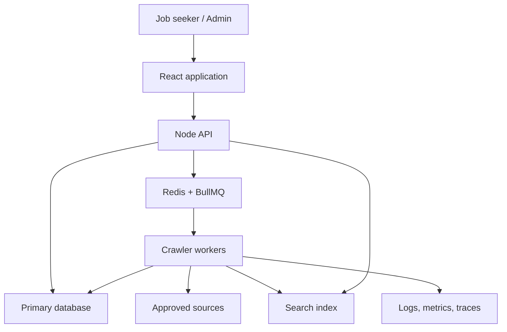

# Lucohire Target System Blueprint

## 1. Executive interpretation

The intended product is not merely a web scraper. It is a **job intelligence and aggregation platform** that continuously ingests public job information from approved company career pages, ATS platforms, APIs, and feeds; converts inconsistent source data into a trusted internal model; removes duplicates; manages job freshness; exposes searchable jobs to users; and gives operators visibility into crawler health and data quality.

The system should be understood as:

> **Source → Discovery → Fetch → Extract → Normalize → Validate → Deduplicate → Store → Index → Present → Refresh/Expire**

Recruiter/contact discovery is a related but separate data domain. It should only retain professional contact information that is publicly presented for recruitment purposes, with provenance and removal controls. It should not infer, guess, or harvest private personal contact details.

## 2. Product boundaries

### In scope

- Register and manage companies and their approved job sources.
- Discover individual job URLs from career pages, sitemaps, feeds, ATS pages, and permitted public endpoints.
- Detect common ATS providers and route sources through provider-specific adapters.
- Extract job data using a deterministic priority order.
- Normalize titles, locations, employment types, salary, experience, skills, companies, and dates.
- Deduplicate vacancies while preserving every observed source and change event.
- Track lifecycle from discovery through active, expired, and archived states.
- Search and filter already-ingested data; never make job seekers wait for live crawling.
- Provide admin controls, crawl history, failures, retry state, freshness metrics, and alerts.
- Preserve source attribution and direct users to the original application URL.
- Optionally associate publicly displayed professional recruiter contacts with a job or company.

### Explicitly out of scope

- Bypassing authentication, CAPTCHAs, paywalls, robots policies, or technical access controls.
- Collecting or inferring private/personal recruiter contact data.
- Treating an installed dependency, placeholder UI, mock endpoint, or schema stub as a completed feature.
- Crawling every known page on every schedule when change-aware refresh is possible.
- Running long crawler workloads inside the request/response path of the main API.
- Using an LLM as the default parser for every job in the MVP.

## 3. Primary actors

| Actor | Goal | Main capabilities |
| --- | --- | --- |
| Job seeker | Find trustworthy, current jobs | Search, filter, view normalized job details, follow original apply link, optionally save/alert later |
| Source operator/admin | Add and maintain sources | Add companies/sources, validate policies, crawl now, pause, configure frequency and limits |
| Crawler/data operator | Maintain ingestion health | Inspect runs, failures, parser quality, duplicates, freshness, queues, retries, and source drift |
| Product/business admin | Understand coverage and value | View source coverage, active jobs, new/updated/expired jobs, categories, locations, and data-quality trends |
| System worker | Execute ingestion safely | Discover, fetch, extract, normalize, deduplicate, index, refresh, expire, and log |

## 4. Target capabilities

### T01 — Company and source registry

- Company records, canonical identity, website, career page, industry, and status.
- One company may have multiple sources.
- Source type: career page, ATS, API, XML feed, RSS, or custom.
- ATS type, crawl policy, priority, schedule, last/next run, policy decision, and status.
- Per-domain concurrency, request rate, timeout, redirect, and retry policy.

### T02 — Source-policy and fetch safety

- Record robots and terms-review decisions rather than assuming technical access equals permission.
- Prefer a permitted API/feed over rendered-page crawling.
- Validate URL scheme, host, port, redirects, resolved IPs, and DNS changes.
- Block localhost, private/link-local networks, cloud metadata endpoints, non-HTTP schemes, and internal services.
- Apply egress restrictions, response-size limits, timeouts, content-type checks, and HTML sanitization.

### T03 — URL and change discovery

- Discover job detail URLs from links, sitemaps, feeds, ATS listings, and permitted endpoints.
- Canonicalize URLs and prevent crawl loops.
- Track first seen, last seen, last fetched, content hash, HTTP validators, and next check.
- Reprocess new or changed jobs and selectively refresh active jobs.

### T04 — ATS detection and adapter framework

- Detect Workday, Greenhouse, Lever, SmartRecruiters, iCIMS, SuccessFactors, Oracle, and custom platforms.
- Use a stable adapter interface instead of large provider-specific conditional blocks.
- Keep a generic adapter and allow new adapters without rewriting the pipeline.
- Track adapter version and extraction method for every observation.

### T05 — Extraction strategy

Use this order, falling back only when the higher-confidence method is unavailable or incomplete:

1. Permitted structured API/feed.
2. `JobPosting` JSON-LD on the individual job page.
3. Known ATS adapter/public endpoint.
4. Embedded application state or observed public response.
5. Static HTML parsing.
6. Browser rendering with Playwright.

Store field-level provenance and validation errors. A page that was fetched successfully but produced no valid job is an extraction failure, not a successful crawl.

### T06 — Canonical job model and normalization

The model should cover:

- Company, source, external job ID, canonical/source/application URLs.
- Title, description/summary, responsibilities, qualifications, skills, department, and category.
- Employment type, workplace type, experience, education, and salary with currency/period.
- Structured location including city, state/region, country, remote type, and optional GeoJSON coordinates.
- Posted date, valid-through date, first seen, last seen, last verified, and status.
- Extraction method, parser/adapter version, content hash, quality score, and provenance.

Normalize source variants without destroying raw observations. Maintain controlled vocabularies and aliases for titles, locations, employment types, skills, and companies.

### T07 — Validation and data quality

- Required-field and cross-field validation.
- Date, currency, salary range, location, and URL validation.
- Quality/confidence score based on completeness, consistency, source reliability, and extraction method.
- Quarantine or review state for ambiguous/low-quality records.
- Drift detection when a source's extraction rate or field completeness drops materially.

### T08 — Deduplication and provenance

Deduplicate in layers:

1. Company + external job ID.
2. Canonicalized source/application URL.
3. Company + normalized title + normalized location + workplace type.
4. Description/content similarity for difficult cases.

Do not discard source evidence. Preserve source observations and link them to one canonical job. Merges should be auditable and reversible.

### T09 — Job lifecycle

- States should distinguish discovered, processing, active, updated, suspected stale, expired, archived, failed, and quarantined records.
- A single transient failure must not immediately expire a job.
- Expiry can be supported by `validThrough`, a confirmed 404/410, structured data removal, repeated absence, or a configured policy.
- Keep job events/history instead of silently overwriting every change.

Google's current job-posting guidance requires closed jobs to be expired and recognizes `validThrough`, 404/410, or removing `JobPosting` markup as expiry signals: [Google JobPosting documentation](https://developers.google.com/search/docs/appearance/structured-data/job-posting).

### T10 — Asynchronous crawling and scheduling

- API servers enqueue work; workers perform crawling.
- Start with a small number of cohesive queues, then split only when scaling or isolation requires it.
- Use idempotent jobs, bounded retries, exponential backoff with jitter, dead-letter/review handling, cancellation, and per-source locks.
- Schedule by source priority, freshness target, observed change rate, and failure/backoff state.
- Prevent overlapping runs and thundering-herd behavior.

BullMQ supports distributed execution on Redis, retries, scheduling, and per-worker concurrency: [BullMQ documentation](https://docs.bullmq.io/). Crawlee provides request queues, browser/HTTP crawlers, retry handling, and concurrency controls: [Crawlee PlaywrightCrawler documentation](https://crawlee.dev/js/api/playwright-crawler/class/PlaywrightCrawler).

### T11 — Search and user presentation

- Search only normalized, indexed, active jobs.
- Filters: keyword, company, location, workplace type, employment type, experience, salary, skill, category, and posted date.
- Sorting, pagination, empty/loading/error states, mobile behavior, and accessible controls.
- Job detail should show freshness, source attribution, and an original apply link.
- MongoDB text/geospatial indexes can support an initial implementation; geospatial queries use 2dsphere indexes: [MongoDB geospatial indexes](https://www.mongodb.com/docs/manual/core/indexes/index-types/index-geospatial/).
- Add Atlas Search/OpenSearch only when relevance, typo tolerance, facets, or scale justify operational complexity.

### T12 — Admin and crawler operations

- Source/company CRUD with role-based permissions.
- Crawl now, pause/resume, schedule/limit editing, adapter selection, and safe test crawl.
- Dashboard: healthy/warning/failed sources; queue state; active/new/updated/expired/quarantined jobs; extraction rate; field completeness; duplicate/merge rate.
- Run detail: timestamps, URLs discovered/fetched, extraction methods, new/updated/duplicate/expired counts, failures, retries, and correlation ID.
- Error inbox with classification, ownership, resolution notes, and recurrence counts.
- Audit log for source, policy, merge, lifecycle, and admin changes.

### T13 — Security, privacy, and compliance

- URL fetching is an SSRF-sensitive feature. OWASP recommends application validation plus network segmentation and deny-by-default controls: [OWASP SSRF prevention](https://cheatsheetseries.owasp.org/cheatsheets/Server_Side_Request_Forgery_Prevention_Cheat_Sheet.html).
- Sanitize untrusted scraped HTML before storage/presentation; never execute source scripts in the application origin.
- Protect admin operations with authentication, authorization, rate limiting, audit logs, and least privilege.
- Keep secrets out of source code, logs, crawl artifacts, and reports.
- Define data retention, removal, source attribution, copyright/licensing, and privacy handling.
- For public professional contacts, retain purpose, provenance URL, observed timestamp, verification state, and removal/suppression state.

### T14 — Observability, testing, and deployment

- Structured logs with source ID, crawl run ID, request ID, adapter, stage, and outcome.
- Metrics for queues, latency, fetch status, extraction yield, completeness, duplicates, expiry, retries, and source drift.
- Distributed traces across API → queue → worker → storage/indexing.
- Alerts based on actionable service-level indicators, not only raw exceptions.
- Contract fixtures for each adapter; unit tests for canonicalization/normalization/dedupe; integration tests for queues and persistence; end-to-end admin and search tests; security tests for URL validation and sanitization.
- Containerize API and workers separately, provide health/readiness checks, CI/CD, rollback, backups, and disaster-recovery verification.

OpenTelemetry provides vendor-neutral traces, metrics, and logs for Node.js and browser applications: [OpenTelemetry JavaScript documentation](https://opentelemetry.io/docs/languages/js/).

## 5. Target architecture

The search index may be the primary database's indexes in the MVP. It should become a separate search service only after measurements show the need.

## 6. Recommended stack

This is the target recommendation, not a claim about what the current repository contains. The repository audit must detect the actual stack from manifests, lockfiles, imports, configuration, infrastructure, and runtime entry points.

| Layer | Recommended baseline | Why it fits | Decision rule |
| --- | --- | --- | --- |
| Frontend | Existing React application, preferably TypeScript | Avoids unnecessary rewrite and fits the researched direction | Keep the current framework unless it blocks required workflows |
| API | Existing Node framework with TypeScript; Express/Fastify/Nest are all viable | One language across web, API, adapters, and workers reduces integration cost | Preserve a healthy existing framework; do not migrate for fashion |
| Crawler | Crawlee with HTTP/Cheerio paths and Playwright fallback | Supports queues, retries, concurrency, and dynamic pages while allowing cheap HTTP-first crawling | Browser rendering must be fallback, not default |
| HTML/data parsing | Cheerio plus JSON-LD and feed parsers | Deterministic, inexpensive, testable | Keep parsers adapter-specific and fixture-tested |
| Background work | BullMQ + Redis | Separates API latency from crawling and supports scheduled/retried work | Required before material source scale or scheduled production crawling |
| Primary database | Keep MongoDB for an existing MERN codebase if schema/indexing quality is good; prefer PostgreSQL for a greenfield highly relational platform | Migration cost may exceed benefits; PostgreSQL gives strong relational constraints, while MongoDB fits variable source observations | Decide after repository/data-model audit, not before |
| Search | Primary DB indexes first; Atlas Search/OpenSearch later | Avoids premature operational overhead | Add dedicated search when measured relevance/scale requires it |
| Raw artifacts | S3-compatible object storage, only when retention is justified | Keeps debug/raw snapshots out of primary records | Apply retention, redaction, and access control |
| Observability | Structured logs + OpenTelemetry; Sentry and/or Prometheus/Grafana as deployment fits | Correlates distributed crawler stages | Instrument before large-scale rollout |
| Deployment | Separate API and worker containers; managed DB/Redis where practical | Independent scaling and fault isolation | Kubernetes is not required for MVP |
| Testing | Unit/integration tests plus Playwright for product E2E; adapter fixtures for crawler tests | Crawler correctness depends on repeatable fixtures and drift detection | Do not rely on live third-party pages for the main test suite |

## 7. MVP and staged delivery

### Phase 1 — Prove the ingestion loop

- Company/source registry.
- Policy review state and SSRF-safe URL validator.
- A generic source adapter.
- JSON-LD extraction and static HTML fallback.
- Canonical job model, validation, normalization, and deterministic dedupe.
- Manual crawl from an admin-only flow.
- Active job search/detail with source attribution.
- Crawl runs, errors, and basic metrics.
- Test with 10–20 representative sources across multiple technologies.

### Phase 2 — Production crawling

- Redis/BullMQ workers and scheduler.
- Retry/backoff, idempotency, rate limits, source locks, and change-aware refresh.
- Playwright fallback and Crawlee integration.
- Initial ATS adapters selected from real source coverage.
- Lifecycle/expiry logic, quarantine/review, health dashboard, and alerts.

### Phase 3 — Intelligence and scale

- Advanced search/facets and geospatial capabilities.
- Skill/category enrichment and confidence scoring.
- Semantic search/recommendations only after deterministic quality is measured.
- Job alerts, saved jobs, company profiles, and analytics if product scope requires them.
- Public professional contact layer with stricter provenance/privacy controls.

## 8. How implementation alignment should be scored

Do not report one vague “completed percentage.” Report three separate measures:

1. **Target feature alignment** — weighted implementation coverage of T01–T14.
2. **Production readiness** — security, resilience, testing, observability, deployment, and operational maturity.
3. **Evidence confidence** — how much of the repository/runtime could be verified.

Suggested feature weights:

| Requirement | Weight |
| --- | ---: |
| T01 Source registry | 6 |
| T02 Policy/fetch safety | 9 |
| T03 Discovery/change detection | 7 |
| T04 ATS/adapters | 7 |
| T05 Extraction | 10 |
| T06 Job model/normalization | 10 |
| T07 Data quality | 6 |
| T08 Deduplication/provenance | 8 |
| T09 Lifecycle | 7 |
| T10 Queue/scheduling | 9 |
| T11 Search/presentation | 7 |
| T12 Admin/operations | 6 |
| T13 Security/privacy/compliance | 5 |
| T14 Observability/testing/deployment | 3 |
| **Total** | **100** |

Per requirement: implemented = 1.0, partial = 0.5, stub/placeholder = 0.25, absent = 0, unknown = 0 with an explicit confidence penalty. The audit must explain why every score was assigned.

## 9. Critical decisions still needed

1. What is the actual repository and detected stack?
2. Is the initial customer a job seeker, an internal sourcing team, a recruiter, or all three?
3. Which geography, industries, and first 10–20 sources define the MVP?
4. What source-access policy and approval process will be used?
5. Will Lucohire store full descriptions, licensed text, summaries, or metadata plus an outbound link?
6. Does “recruiter discovery” mean only contacts displayed on job/company pages, or a separate licensed data provider?
7. What source volume, job volume, freshness target, and budget are expected at launch and after one year?
8. Should candidates apply externally, or will Lucohire eventually host applications?
9. What deployment environment and managed services already exist?
10. Is MongoDB a deliberate long-term choice or simply the current implementation?

## 10. Assessment of the originally attached analysis prompt

The attached prompt is comprehensive for producing a **new software specification from an idea**, but it does not reliably answer “how much of my thinking is already integrated in my current project?”

| Problem | Effect | Required correction |
| --- | --- | --- |
| It begins from an idea, not repository evidence | The model may design an ideal system instead of auditing the real one | Require manifests, imports, routes, models, tests, configs, and line-level evidence |
| It asks for every product category | The report can become very long but shallow | Weight Lucohire-specific crawler, lifecycle, provenance, and operational requirements |
| It has no implementation-status taxonomy | Stubs and installed packages may be counted as finished | Use implemented/partial/stub/absent/unknown definitions |
| It has no scoring or confidence method | “80% complete” can be arbitrary | Publish weights, calculations, and evidence confidence |
| It does not distinguish declared from used technology | `package.json` alone can misrepresent the stack | Verify lockfiles, imports, entry points, configs, and runtime wiring |
| It does not require end-to-end tracing | A UI screen may be mistaken for a complete feature | Trace UI → API → service/queue → persistence → tests/observability |
| It may silently fill unknowns | Gaps become invented architecture | Mark unknowns and open decisions explicitly |
| It is not crawler-specific enough | Critical SSRF, rate-limit, policy, drift, and expiry gaps may be missed | Embed T01–T14 as the target baseline |

Use the companion repository-gap audit prompt to inspect the actual project.
