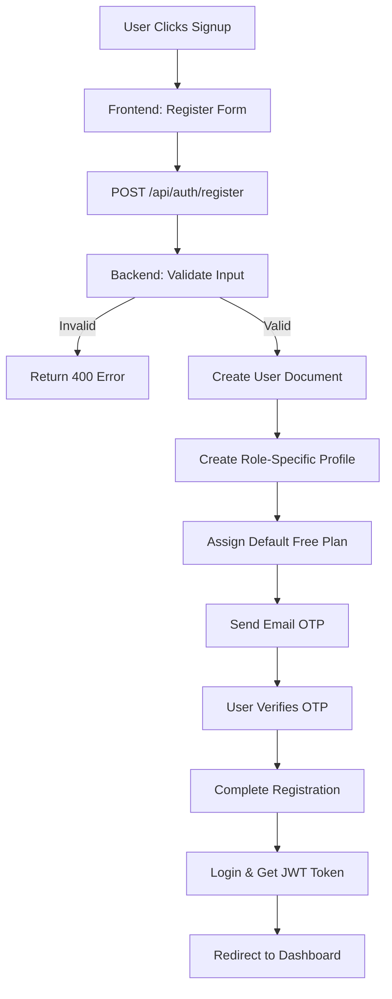

# 02_SYSTEM_ARCHITECTURE.md

## High-Level Architecture

Lucohire follows a **Model-View-Controller (MVC)** pattern with a separate frontend and backend.

```
┌─────────────────────────────────────────────────────────────────┐
│                          FRONTEND LAYER                           │
│  (React 18 + Vite)                                                  │
│  - UI Components & Pages                                           │
│  - React Router for navigation                                    │
│  - Context Providers (Auth, Location, Locale, Language)           │
│  - API Clients (Axios)                                            │
│  - State Management (via Context API)                             │
│  - Socket.io-client for realtime                                  │
│  - Helmet-async for SEO metadata                                  │
└───────────────────────▲─────────────────────────────────────────┘
                        │ HTTPS/REST API
                        │
┌─────────────────────────────────────────────────────────────────┐
│                          BACKEND LAYER                              │
│  (Node.js + Express 4.21.0)                                       │
│  -------------------------------------------------------------- │
│  │  ▲                                ▲                          │  │
│  │  │                                │                          │  │
│  │  │  Request Body / Params        │  Response JSON          │  │
│  │  │                                │                          │  │
│  │  ▼                                ▼                          │  ▼
│  │  ┌─────────────────┐  ┌─────────────────────┐              │  │
│  │  │   Middleware    │  │   Error Handler     │              │  │
│  │  │   (auth, rate   │  │   (errorHandler)    │              │  │
│  │  │    limit, cors) │  │                     │              │  │
│  │  └─────────────────┘  └─────────────────────┘              │  │
│  │           │                           │                    │  │
│  │           ▼                           ▼                    │  │
│  │  ┌─────────────────────────────────────────────────┐      │  │
│  │  │                 Routes                         │     │  │
│  │  │  /api/auth, /api/provider, /api/recruiter,    │     │  │
│  │  │  /api/admin, /api/payments, /api/search,      │     │  │
│  │  │  /api/jobs, /api/subscriptions, etc.        │     │  │
│  │  └─────────────────────────────────────────────────┘      │  │
│  │           │                           │                    │  │
│  │           ▼                           ▼                    │  │
│  │  ┌─────────────────────────────────────────────────┐      │  │
│  │  │               Controllers                       │     │  │
│  │  │  Auth controller, Provider controller,        │     │  │
│  │  │  Payment controller, Search controller,       │     │  │
│  │  │  Subscription controller, etc.                │     │  │
│  │  └─────────────────────────────────────────────────┘      │  │
│  │           │                           │                    │  │
│  │           ▼                           ▼                    │  │
│  │  ┌─────────────────────────────────────────────────┐      │  │
│  │  │               Services                        │     │  │
│  │  │  Auth service, Provider service,              │     │  │
│  │  │  Payment service, Notification service,       │     │  │
│  │  │  Search service, AI service, etc.             │     │  │
│  │  └─────────────────────────────────────────────────┘      │  │
│  │           │                           │                    │  │
│  │           ▼                           ▼                    │  │
│  │  ┌─────────────────────────────────────────────────┐      │  │
│  │  │               Models (Mongoose)               │     │  │
│  │  │  User, ProviderProfile, RecruiterProfile,     │     │  │
│  │  │  Plan, Payment, Notification, etc.            │     │  │
│  │  └─────────────────────────────────────────────────┘      │  │
│  │           │                           │                    │  │
│  │           ▼                           ▼                    │  │
│  │  ┌─────────────────────────────────────────────────┐      │  │
│  │  │               Database (MongoDB)              │     │  │
│  │  │  Collections: users, provider_profiles,       │     │  │
│  │  │  recruiter_profiles, plans, payments,        │     │  │
│  │  │  notifications, subscriptions, etc.          │     │  │
│  │  └─────────────────────────────────────────────────┘      │  │
│  └───────────────────────▲─────────────────────────────────────┘
                          │ MongoDB Driver
                          │
┌─────────────────────────────────────────────────────────────────┐
│                          EXTERNAL SERVICES                        │
│  ┌─────────────────────────────────────────────────────────────┐│
│  │  Cloudinary           │ Redis/Upstash              ││
│  │  (File/ Media Storage)│ (Cache / Queues)            ││
│  └─────────────────────────────────────────────────────────────┘│
│  ┌─────────────────────────────────────────────────────────────┐│
│  │  Stripe / Razorpay    │ Upstash REST API              ││
│  │  (Payments)           │ (Edge caching)                ││
│  └─────────────────────────────────────────────────────────────┘│
│  ┌─────────────────────────────────────────────────────────────┐│
│  │  Google Maps/Places   │ SendGrid / Resend               ││
│  │  (Location)           │ (Email)                       ││
│  └─────────────────────────────────────────────────────────────┘│
│  ┌─────────────────────────────────────────────────────────────┐│
│  │  OpenAI / Anthropic   │ Meta WhatsApp Business API      ││
│  │  (AI Features)        │ (SMS/WhatsApp)                  ││
│  └─────────────────────────────────────────────────────────────┘│
│  ┌─────────────────────────────────────────────────────────────┐│
│  │  Apify                │ Typesense                       ││
│  │  (Web Scraping)       │ (Search Engine)                 ││
│  └─────────────────────────────────────────────────────────────┘│
└─────────────────────────────────────────────────────────────────┘

## Authentication Architecture

**JWT-based Authentication Flow:**
1. User registers/login → credentials verified
2. Backend generates JWT token via `jwt.sign({ id, userId, role }, JWT_SECRET)`
3. Token expires in `JWT_EXPIRE` (default: 7 days)
4. Token stored in frontend (localStorage/sessionStorage)
5. Authenticated requests include: `Authorization: Bearer <token>`
6. Backend middleware `protect` verifies token and attaches `req.user`

**OAuth Flows:**
- **Google OAuth:** Frontend obtains access token → backend verifies with Google → user created/login
- **WhatsApp OTP:** User provides phone → OTP sent via Meta API → OTP verified → user created/login

**Role & Panel System:**
- Users can have multiple roles: `["provider", "recruiter"]`
- `activeRole` determines which panel/portal user accesses
- `panelAccess` controls which panel features are enabled
- Role switching via `/api/auth/switch-role`

## Storage Architecture

**File Storage:**
- **Primary:** Cloudinary for avatar/profile photos and resumes
- **Secondary:** Local `uploads/` directory (express.static serving)
- **Backup:** AWS S3 (dependency in package.json but usage needs verification)
- **Upload Flow:**
  1. Frontend uploads multipart/form-data to `/api/profile/photo` or `/api/profile/resume`
  2. Backend `multer` middleware handles upload to local `uploads/` directory
  3. File URL stored in database (Cloudinary URL or local path)
  4. Frontend retrieves and displays the asset

**Database Storage:**
- MongoDB Atlas as primary data store
- Mongoose schemas with field encryption for bank details
- Timestamps auto-added (`createdAt`, `updatedAt`)
- Indexes on: `email`, `phone`, `roles`, `status`, `location`, `geoPoint`

**Caching Architecture:**
- **Redis (Upstash):** Primary cache and BullMQ queue backend
- **Response caching:** `Cache-Control: no-store` on auth routes
- **Query caching:** Typesense for search results
- **No browser HTTP caching** configured for sensitive endpoints

## Communication Paths

**HTTP API:**
- All backend routes prefixed with `/api`
- Versioned routes: `/api/v1/` for many features
- Public routes: `/api/skills`, `/api/public/company-details`, `/api/public/newsletter/subscribe`
- Protected routes: require JWT authentication

**WebSocket (Socket.io):**
- Real-time bidirectional communication
- Used for: new notifications, unread count updates
- Connection: `http://localhost:5000` (from VITE_SOCKET_URL)
- Rooms: Users join `user_${userId}` room for targeted notifications
- Events: `new_notification`, `notification`, `unread_count`

**Background Jobs:**
- BullMQ queues for: candidate digest, homepage metrics, outreach, batch scraping
- Node-cron for: pipeline cron, subscription cron, recruiter usage cron
- Workers process jobs asynchronously

## Database Architecture

**Primary Database:** MongoDB Atlas

**Key Collections/ Tables:**
- `users` - Core user data, authentication, roles
- `provider_profiles` - Provider-specific data (skills, pricing, portfolio)
- `recruiter_profiles` - Recruiter-specific data (company info, hiring preferences)
- `plans` - Subscription plans (provider/recruiter, free/paid)
- `user_subscriptions` - Active subscriptions per user/role
- `payments` - Payment records (Stripe/Razorpay transactions)
- `notifications` - In-app notifications
- `otp` - One-time passwords for verification
- `commission_transactions` - Referral commissions
- `provider_wallets` - Provider wallet balances
- `referrals` - Referral tracking

**Relationships:**
- `users._id` → `provider_profiles.user` (one-to-one, unique)
- `users._id` → `recruiter_profiles.user` (one-to-one, unique)
- `user_subscriptions.planId` → `plans._id` (many-to-one)
- `payments.user` → `users._id` (many-to-one)
- `payments.plan` → `plans._id` (many-to-one, nullable for custom)

**Indexes (Key Performance):**
- `users`: `email_1`, `phone_hash_1`, `status_1`, `approvalStatus_1`, `location_2dsphere`
- `provider_profiles`: `skills_1`, `city_1`, `tier_1`, `boostWeight_-1`, `geoPoint_2dsphere` (sparse)
- `recruiter_profiles`: `geoPoint_2dsphere` (sparse)
- `plans`: `type_1`, `slug_1`, `isActive_1`, `isProviderDefault_1`
- `user_subscriptions`: `userId_1`, `role_1`, `status_1`, `endDate_1`

## External Services Architecture

**Payment Processing:**
- **Stripe:** For international/USD transactions
  - Publishable key on frontend
  - Webhooks server-side for event handling
  - Checkout sessions for plan purchases
- **Razorpay:** For India-focused payments (INR)
  - Full integration with order creation and verification
  - Subscription management
  - Webhook handling for payment confirmations
  - **Note:** Test IDs configured but live keys in .env

**AI Services:**
- **OpenAI:** Embeddings, general AI features
- **Anthropic Claude:** Haiku model for AI features
- **Gemini:** Resume parsing (first priority), AI features
- **Google Cloud Translation:** Text translation
- **Google Cloud Vision:** OCR for document processing

**Location & Maps:**
- **Google Places API:** Location autocomplete and details
- **Geoapify:** Alternative maps/geo services
- **Lat/Lng to city/state detection:** Utility functions

**Email Services:**
- **SMTP (Hostinger):** Primary transactional email
- **Resend:** Fallback/alternative email service
- **Templates:** HTML emails for OTP, password reset, match notifications

**File Storage:**
- **Cloudinary:** Main storage for images, documents, resumes
- **AWS S3:** Listed as dependency, usage needs verification
- **Local uploads:** Development fallback

**Search:**
- **Typesense:** Full-text search engine
- **Geo-spatial:** Mongoose 2dsphere indexes for location queries

**Queue & Caching:**
- **Redis (Upstash):** BullMQ backend for background jobs
- **Upstash REST API:** Standard cache if needed

## Mermaid Diagrams

### Authentication Flow
```mermaid
flowchart TD
    A[User Action] --> B[Frontend Login/Register]
    B --> C[POST /api/auth/login/register]
    C --> D[Backend Auth Controller]
    D --> E[JWT Verification]
    E --> F[Generate Token]
    F --> G[Return Token to Frontend]
    G --> H[Store Token (localStorage)]
    H --> I[Authenticated Requests]
    I --> D[Middleware: protect]
    D --> J[req.user Attached]
    J --> K[Route Handler]
    K --> L[Business Logic]
    L --> M[Database Operations]
    M --> N[JWT Token in Response]
```

### Payment Flow (Razorpay)
```mermaid
flowchart TD
    A[User Clicks Purchase] --> B[Frontend: Redirect to Razorpay]
    B --> C[POST /api/payments/create-order]
    C --> D[Razorpay Order Creation]
    D --> E[Return Order ID + Payment Record (status: pending)]
    E --> F[Frontend: Razorpay Checkout]
    F --> G[User Completes Payment]
    G --> H[Frontend: POST /api/payments/verify]
    H --> I[Backend: Verify Signature]
    I --> J[Payment Record: status → completed]
    J --> K[Backend: Activate Plan]
    K --> L[Update ProviderProfile/RecruiterProfile]
    L --> M[Send Notification]
    M --> N[User Dashboard Updated]
```

### User Registration Flow


### Search Flow
```mermaid
flowchart TD
    A[User Enters Search] --> B[Frontend: Send Query Params]
    B --> C[GET /api/search/providers]
    C --> D[Middleware: validateRequest]
    D --> E[Backend: searchProviders Controller]
    E --> F[Build MongoDB Query]
    F -->|With Filters| G[ProviderProfile.find()]
    G -->|Geo-spatial| H[$geoNear / $text search]
    H --> I[Populate User Data]
    I --> J[Return Provider List]
    J --> K[Frontend: Render Results]
```

### Notification Flow
```mermaid
flowchart TD
    A[Trigger Event] --> B[Backend: Create Notification Doc]
    B --> C[Notification.create()]
    C --> D[Emit via Socket.io]
    D --> E[User Room: user_{userId}]
    E --> F[emit('new_notification', payload)]
    F --> G[Frontend: Use useEffect listener]
    G --> H[Update UI: Badge + Message]
    H --> I[Mark as Read on Click]
    I --> J[API: PUT /api/notifications/:id/read]
    J --> K[Database: isRead → true]
    K --> L[Emit: unread_count Updated]
```