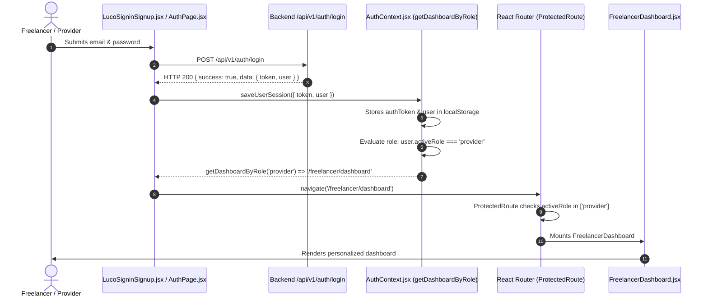
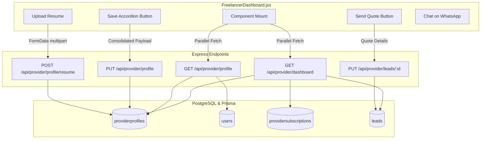

# LucoHire Freelancer Dashboard: Architecture, Flow & API Specification

> **Document Version**: 1.0.0  
> **Target Audience**: Full-Stack Developers, Product Engineers & System Architects  
> **Repository**: `Subrat053/lucohire_v2`  
> **Source Component**: `frontend/src/pages/freelancer/FreelancerDashboard.jsx`  
> **Backend Integration**: Node.js/Express, PostgreSQL, Prisma ORM

---

## 1. Architectural Overview & Design Philosophy

The **Freelancer Dashboard** (`/freelancer/dashboard`) represents the primary workspace for candidates and independent service professionals on LucoHire. It replaces the legacy provider interface for all post-login freelancer workflows while preserving existing backend contracts and legacy routes.

### 1.1 Core Principles
1. **Zero Impact on Legacy Provider System**:
   - `frontend/src/components/provider/ProviderLayout.jsx` and `frontend/src/pages/provider/Dashboard.jsx` remain **100% untouched**.
   - Sub-routes such as `/provider/plans`, `/provider/wallet`, `/provider/career-health`, and `/provider/grow-with-ai` continue operating under `ProviderRoutes.jsx`.
2. **Dual Responsive Layout**:
   - **Mobile View (<= 640px)**: A strictly bounded **430px centered container** replicating native mobile app design with an anchored bottom navigation dock.
   - **Desktop View (>= 768px)**: A responsive **12-column grid** (8 columns main content + 4 columns sticky sidebar).
3. **100% Dynamic PostgreSQL Binding**:
   - Zero hardcoded mock values. Every visual stat, hero pill, completion ring percentage, active plan meter, and lead inquiry pulls from PostgreSQL through authenticated APIs.
4. **Granular Accordion Persistence**:
   - Instead of a monolithic profile form, 8 independent accordion panels allow section-by-section editing with dedicated **"Save"** handlers, optimistic UI updates, and instant toast feedback.

---

## 2. Route Classification & Redirection Architecture

### 2.1 Route Tree in `frontend/src/App.jsx`
All application routes are cleanly categorized into 8 functional suites:

```
App.jsx (Router)
├── Category 1: Freelancer & Candidate Suite
│   ├── /freelancer/dashboard  ─── ProtectedRoute (allowedRoles: ['provider']) ─── FreelancerDashboard.jsx
│   └── /candidate/dashboard   ─── Redirect to /freelancer/dashboard
├── Category 2: Legacy Provider Panel Suite (Untouched)
│   └── /provider/*            ─── ProviderRoutes.jsx (ProviderLayoutWrapper)
├── Category 3: Recruiter Panel Suite
│   └── /recruiter/*           ─── RecruiterRoutes.jsx
├── Category 4: Admin Panel Suite
│   └── /admin/*               ─── AdminRoutes.jsx
├── Category 5: Partner & Manager Panel Suite
│   └── /partner/*             ─── PartnerRoutes.jsx
├── Category 6: Global Role-Aware Dashboard Redirect
│   └── /dashboard             ─── DashboardRedirect.jsx
├── Category 7: Authentication & Public Portal Routes
│   └── /*                     ─── AuthRoutes.jsx
└── Category 8: Role-Aware 404 Fallback
    └── *                      ─── NotFound.jsx
```

### 2.2 Post-Authentication Redirection Flow



---

## 3. End-to-End User Experience & Feature Guide

The dashboard is divided into two primary views (**Dashboard** and **Leads**), supplemented by modal dialogs:

### 3.1 Top Navigation Bar (Header)
- **Today's Eyebrow & Greeting**: Dynamically displays the current day/month (e.g., `Wednesday, 19 September`) and user's first name (`Namaste, Subrat`).
- **Desktop Tab Switcher**: Pill-shaped tabs toggling between `Dashboard` (with grid view icon) and `Leads` (with inquiry icon and unread dot indicator).
- **Resume Journey Shortcut**: Launches the interactive ATS resume check tool.
- **Client Preview Button (`Preview as client`)**: Opens the modal rendering how recruiters view the freelancer's card in search discovery.
- **Notification Bell**: Prompts unread notification alerts.
- **User Avatar Chip**: Displays the uploaded photo (`profilePhoto` / `photo`) or two-letter gradient monogram.

---

### 3.2 View 1: Main Dashboard Tab

#### A. Profile Strength Ring Banner
- **Visual**: Circular animated `conic-gradient` showing exact completion percentage (`profileCompletion` from database).
- **Dynamic Guidance**:
  - `< 50%`: Advises adding starting skills, prices, and past experience to start receiving leads.
  - `50% - 84%`: Recommends uploading a voice intro or completing ID verification for a 4.5x visibility boost.
  - `>= 85%`: Awards an **All-Star Freelancer** banner ranking high in client searches.

#### B. Candidate / Freelancer Hero Card
- **Avatar & Availability Badge**: Shows "Available Now", "Part-time", or "Weekends" with green pill overlay.
- **Identity Verified Checkmark**: Green verification badge displayed if `isVerified: true` or `idVerification.status === 'verified'`.
- **Title & Location Pill**: Displays headline skill/title (`profile.professionalTitle`), city, state, and `🌐 Remote OK` flag.
- **Candidate Stats Row**: 3 key metrics:
  1. *Experience* (e.g., "3–5 yrs" or "Fresher")
  2. *Availability* (e.g., "Full-time")
  3. *Available to start* (e.g., "Immediately" / "Within 1 week")
- **Top Skills & Starting Rates**: Pills rendering skill title alongside starting rate (e.g., `Figma UI Design · ₹8,000/project`).
- **Highlight Cards**:
  - 💰 *Starting Price*: Formatted Indian Rupee starting price (`₹3,000`).
  - 🗣️ *Languages*: Language tags count (e.g., `Hindi, English · 2 Languages`).
- **Verification Checklist**: Three verification status badges (Resume Uploaded, Mobile Verified, Email Verified).
- **Hero Actions**:
  - `👁️ View Profile`: Launches preview modal.
  - `💬 Share on WhatsApp`: Generates WhatsApp sharing intent URL.
  - `📞 Verified Contact`: Shows verified phone/email.

#### C. Performance Metrics Strip (Sidebar on Desktop, Stacked on Mobile)
- **Profile Views this Week**: Real-time weekly view counter from `providermetrics` / `providerprofiles`.
- **Active Recruiter Leads**: Live count of client inquiries received this week.
- **Response Rate**: Calculated response percentage based on answered inquiries (e.g., `95%`).

#### D. Active Subscription Card
- **Plan Badge**: Current tier (`Default Free Provider Plan`, `LucoHire Pro`, etc.).
- **Pricing**: `₹0` for free plans or `₹399/mo` for priority tiers.
- **Feature Checklist**: Verified benefits included in the plan (unlimited WhatsApp leads, priority search placement, verified badge).
- **Usage Tracker**: Lead counter and application allowance meters.
- **Plan Management Link**: Direct router navigation to `/provider/plans`.

---

### 3.3 Manage Profile & Portfolio (8 Interactive Accordions)

Every accordion panel operates independently with input state, a dedicated **"Save"** button, loading spinners, and instant database persistence:

```
┌───────────────────────────────────────────────────────────────────────────┐
│ ACCORDION PANEL                 │ PERSISTED POSTGRESQL DATA FIELD         │
├─────────────────────────────────┼─────────────────────────────────────────┤
│ 1. Skills & Pricing             │ pricingEntries, skills, pricing         │
│ 2. Education & Work Experience  │ education (degree, institution, year)   │
│ 3. Certifications & Portfolio   │ portfolioLinks (type, link)             │
│ 4. Languages & Proficiency      │ languages, languageEntries              │
│ 5. Availability & Preferences   │ availability, workHours, startTimeline  │
│ 6. Voice & Video Pitch          │ voiceIntroUrl, videoIntroUrl            │
│ 7. Resume Document              │ resumeUrl (Multipart upload to backend) │
│ 8. ID Verification              │ idVerification (idType, idNumber)       │
└───────────────────────────────────────────────────────────────────────────┘
```

#### Accordion Operations:
1. **Skills & Pricing**: Freelancers can add skills, select expertise level (*Beginner*, *Intermediate*, *Expert*), assign experience brackets (*1-3 yrs*, *3-5 yrs*, *5+ yrs*), and set starting price with pricing model (*Per project*, *Per hour*, *Per day*, *Negotiable*).
2. **Education & Work Experience**: Freelancers add degrees or job roles, institution/company names, and years of completion.
3. **Certifications & Portfolio**: Connect external showcases (*Behance*, *Dribbble*, *GitHub*, *LinkedIn*, or custom portfolio URLs).
4. **Languages**: Add Indian and international languages (*Hindi*, *English*, *Bengali*, *Marathi*, *Tamil*, *Telugu*, etc.) paired with proficiency (*Basic*, *Fluent*, *Expert*).
5. **Availability & Work Preferences**: Set work capacity (*Full-time*, *Part-time*, *Weekends*), select active working days (*Mon–Sun*), and define daily hours (*10:00 AM – 06:00 PM*).
6. **Voice & Video Pitch**: Add audio and video intro links (Google Drive, YouTube, Vimeo). Complete intros boost profile completion by 8%.
7. **Resume Document**:
   - File picker supporting `.pdf` and `.docx` up to 10MB.
   - Multipart upload to backend endpoint (`POST /api/provider/profile/resume`).
   - Displays uploaded file with a direct download/view link.
8. **ID Verification**: Input Aadhaar, PAN, or Passport number to submit for administrative verification badge.

---

### 3.4 View 2: Dynamic Leads Pipeline Tab
Accessed via the top navigation or bottom mobile dock:

- **Pipeline Summary Banner**: Displays total leads, response rate, won projects, and average reply time (15 mins).
- **Skill Filter**: Dynamically populated from the freelancer's registered skills (e.g. `All skills`, `UI/UX Design`, `Branding`).
- **Status Filter**: `All`, `New`, `Replied`, `Won`.
- **Recruiter Lead Cards**:
  - Recruiter Name & Initial Avatar.
  - Time elapsed (`15 min ago`, `2 hr ago`, `Yesterday`).
  - Project brief description & required skills.
  - Client offered budget (`Offered ₹15,000`) & timeline (`needed within 10 days`).
  - Status badge (*New*, *Replied*, *Won*).
  - **Direct WhatsApp Chat**: One-click link formatting:
    ```
    https://wa.me/${lead.recruiterPhone}?text=Hi%20${lead.name},%20I%20saw%20your%20project%20"${lead.projectTitle}"%20on%20LucoHire.%20I%20am%20available%20to%20help.
    ```
  - **Inline Send Quote Drawer**:
    - Project price quote input (₹).
    - Timeline dropdown (3 days, 5 days, 7 days, 14 days, 1 month).
    - Custom proposal note textarea.
    - Submit quote button calling `providerAPI.updateLead(lead.id, payload)`.
    - Updates lead status in real-time to **"Replied"** with quote summary displayed.

---

## 4. Backend API Mapping Specification

The dashboard integrates with existing backend services under `/api/provider/*` and `/api/v1/auth/*`:



### 4.1 Exhaustive API Mapping Matrix

| Feature / UI Trigger | HTTP | Backend Route | Controller Function | Primary Payload / Parameters | PostgreSQL Tables Affected |
| :--- | :--- | :--- | :--- | :--- | :--- |
| **Initial Dashboard Load** | `GET` | `/api/provider/dashboard` | `getDashboard` | *None* (Bearer JWT Header) | `providerprofiles`, `leads`, `providersubscriptions`, `providermetrics` |
| **Full Profile Fetch** | `GET` | `/api/provider/profile` | `getMyProfile` | *None* (Bearer JWT Header) | `providerprofiles`, `users` |
| **Save Skills & Rates** | `PUT` | `/api/provider/profile` | `updateProfile` | `{ pricingEntries: [...], skills: [...] }` | `providerprofiles` (`pricingEntries`, `skills`) |
| **Save Education & Work** | `PUT` | `/api/provider/profile` | `updateProfile` | `{ education: [...] }` | `providerprofiles` (`education`) |
| **Save Portfolio Links** | `PUT` | `/api/provider/profile` | `updateProfile` | `{ portfolioLinks: [...] }` | `providerprofiles` (`portfolioLinks`) |
| **Save Languages** | `PUT` | `/api/provider/profile` | `updateProfile` | `{ languages: [...] }` | `providerprofiles` (`languages`) |
| **Save Availability** | `PUT` | `/api/provider/profile` | `updateProfile` | `{ availability, workHours, preferredProjectDuration }` | `providerprofiles` (`availability`, `workHours`) |
| **Save Voice/Video Intros** | `PUT` | `/api/provider/profile` | `updateProfile` | `{ voiceIntroUrl, videoIntroUrl }` | `providerprofiles` (`voiceIntroUrl`, `videoIntroUrl`) |
| **Resume Document Upload** | `POST` | `/api/provider/profile/resume` | `uploadResume` | `multipart/form-data` (`resume: File`) | `providerprofiles` (`resumeUrl`) |
| **Submit ID Verification** | `PUT` | `/api/provider/profile` | `updateProfile` | `{ idVerification: { idType, idNumber, status: 'pending' } }` | `providerprofiles` (`idVerification`) |
| **Submit Recruiter Quote** | `PUT` | `/api/provider/leads/:id` | `updateLead` | `{ status: 'replied', notes: JSON.stringify(quoteData) }` | `leads` (`status`, `notes`) |
| **Email Sign-in** | `POST` | `/api/v1/auth/login` | `loginEmailV1` | `{ email, password }` | `users` (`lastLogin`) |

---

## 5. Technical Safeguards & Implementation Details

### 5.1 Profile Update Consolidation Safeguard
The backend `updateProfile` controller strictly enforces mandatory presence of core identity attributes:
```javascript
// backend/controllers/providerController.js
if (!skills || skills.length === 0) return res.status(400).json({ message: "Speciality/Skill is mandatory" });
if (!cleanPhone || cleanPhone.length < 10) return res.status(400).json({ message: "A valid 10-digit number is mandatory" });
if (!roles || roles.length === 0) return res.status(400).json({ message: "Job Role is mandatory" });
if (!tier) return res.status(400).json({ message: "Skill tier is mandatory" });
```

#### Frontend Safeguard Implementation:
In `FreelancerDashboard.jsx`, the function `handleSaveProfileSection()` automatically merges section edits with the existing profile's base attributes:
```javascript
const basePayload = {
  name: profile?.profileName || user?.name || "Freelancer",
  profileName: profile?.profileName || user?.name || "Freelancer",
  skills: skillsList.length > 0 ? skillsList.map((s) => s.title) : profile?.skills,
  roles: profile?.roles || ["Freelancer"],
  tier: profile?.tier || "skilled",
  phone: profile?.phone || user?.phone || "9999999999",
  city: profile?.city || "Delhi",
  state: profile?.state || "Delhi",
  serviceLocations: profile?.serviceLocations || [profile?.city || "Delhi"],
  locations: profile?.locations || [profile?.city || "Delhi"],
  ...sectionUpdates,
};
await providerAPI.updateProfile(basePayload);
```
This guarantees that updating a single section (like languages or portfolio links) never fails due to missing top-level mandatory fields.

---

### 5.2 Password Projection in Database Repository
To ensure email login operates reliably with Prisma:
- **Repository Fix**: In `backend/repositories/prismaModel.js` (line 362), `createDocument()` now receives `{ projection: this.projection }`.
- **Outcome**: When `User.findOne({ email }).select('+password +role')` is called during sign-in, the password hash is preserved on the User model instance, allowing `bcrypt.compare()` to authenticate credentials accurately.

---

## 6. Verification & Health Audit Checklist

| Component / Flow | Test Command / Procedure | Expected Status |
| :--- | :--- | :--- |
| **Backend Health** | `GET http://localhost:5000/api/health` | `HTTP 200 { status: 'OK' }` |
| **Frontend Server** | `GET http://localhost:5173/login` | `HTTP 200` |
| **Email Sign-in API** | `POST http://localhost:5000/api/v1/auth/login` | `HTTP 200 { success: true, data: { token, user } }` |
| **Frontend Production Bundle**| `npm run build` in `frontend/` | `Exit code: 0` (Vite build + Puppeteer prerender) |
| **Freelancer Route Protection**| Direct navigation to `/freelancer/dashboard` without auth | Redirects to `/login` |
| **Legacy Route Integrity** | Navigation to `/provider/dashboard` | Renders legacy `ProviderLayout` |
