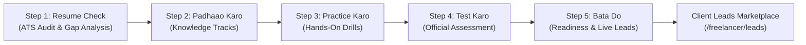

# LucoHire Freelancer Resume Journey: Comprehensive Architectural & Flow Documentation

This document provides complete technical and functional documentation for the **5-Step Resume Journey** on `/freelancer/resume` within LucoHire. It details the system architecture, state lifecycle, mathematical scoring algorithms, component structure, desktop/mobile responsive behavior, and integration with the live client lead marketplace.

---

## 1. Executive Summary & Purpose

The **Resume Journey** transforms a freelancer's raw profile into an objectively benchmarked, client-ready candidate. It bridges the gap between passive profiles and active client hiring by:
1. Auditing the freelancer's resume against automated Applicant Tracking Systems (ATS) and industry keywords.
2. Delivering targeted study tracks (*Padhaao*) tailored to high-demand engineering paths.
3. Providing simulated technical interview drills (*Practice*) with instant reasoning and streak tracking.
4. Administering an official, timed technical assessment (*Test*) with flag and question palette navigation.
5. Generating an authoritative readiness verdict (*Bata Do*) featuring a weighted composite score, shareable verification credential, personalized 30-day closing-the-gap plan, and direct handoff to live client leads (`/freelancer/leads`).



---

## 2. System Architecture & Directory Structure

All legacy monolithic HTML code (`resume.html`, ~174KB) was migrated into modern, modular React components located at:
`frontend/src/components/freelancer/resume-journey/`

```
frontend/src/components/freelancer/resume-journey/
├── ResumeJourneyContainer.jsx       # Root shell: Sticky Step Navigator & View switcher
├── context/
│   └── ResumeJourneyContext.jsx     # Unified journey state provider & localStorage bridge
├── engine/
│   ├── atsScoringEngine.js          # Dynamic ATS scoring & keyword analysis
│   └── readinessEngine.js          # Composite readiness score & dynamic 30-day action plan
├── data/
│   ├── resumeStep1Data.js           # Career paths, bullet rewrites, skills matrix, 2030 roadmaps
│   ├── padhaaoData.js               # Study tracks & syllabus chapters per path
│   ├── practiceData.js              # Interactive interview questions with explanations
│   ├── testData.js                  # Official assessment question banks per career path
│   └── batadoData.js                # Plan A/B salary data, roles, and readiness benchmarks
├── common/
│   ├── ScoreGauge.jsx               # Animated SVG circular gauge with color thresholds
│   └── JourneyProgressBar.jsx       # 5-step navigation stepper with completion checks
└── steps/
    ├── Step1ResumeCheck/
    │   ├── ResumeCheckStep.jsx      # Step 1 container: Balanced 2-column layout
    │   ├── ResumeUploadCard.jsx     # ATS score display, profile stats, & re-upload trigger
    │   ├── CareerPathSelector.jsx   # Selectable target roles (Full Stack, Backend, Frontend, etc.)
    │   ├── ActionableBulletsCard.jsx# Before/after metric-driven bullet points
    │   ├── SkillsMatrixCard.jsx     # Critical missing, strong, & recommended skill tags
    │   └── FutureRoadmapCard.jsx    # 2030 AI-era market longevity & engineering trends
    ├── Step2Padhaao/
    │   ├── PadhaaoStep.jsx          # Step 2 container: Left Track Navigator + Right Chapters
    │   ├── TrackTabs.jsx            # Multi-mode tab switcher (horizontal for mobile, vertical for desktop)
    │   ├── ChapterCard.jsx          # Chapter card with reading time, difficulty, & completion status
    │   └── PadhaaoSummaryCard.jsx   # Progress gauge & completion stats
    ├── Step3Practice/
    │   ├── PracticeStep.jsx         # Step 3 container: Mode Selector, Runner, & Results
    │   ├── ModeSelectorCard.jsx     # Quick 5, Full 15, Weak Areas, Speed Drill selector
    │   ├── PracticeRunnerCard.jsx   # Interactive quiz runner with immediate explanations
    │   └── PracticeResultsCard.jsx  # Score gauge, streak, topic breakdown & solution review
    ├── Step4Test/
    │   ├── TestStep.jsx             # Step 4 container: 2-Column Intro, Runner, & Results
    │   ├── TestRunnerCard.jsx       # Timed exam runner (90s/q), Flag toggles, Question Palette
    │   ├── TestSubmitModal.jsx      # Confirmation dialog with answered/flagged summary
    │   └── TestResultsCard.jsx      # 2-Column results: Gauge on left, Topic Mastery on right
    └── Step5BataDo/
        ├── BataDoStep.jsx           # Step 5 container: 3-Tier executive dashboard
        ├── VerdictHeroCard.jsx      # Full-width composite score hero & evaluated pillars
        ├── JobReadyCertificate.jsx  # Shareable credential card with verification ID
        ├── PlanComparisonTabs.jsx   # Plan A (Moonshot) vs. Plan B (Fast-Track safety net)
        └── DynamicActionPlan.jsx    # Personalized 4-week gap-closing schedule
```

---

## 3. End-to-End User Flow & Logic Breakdown

### Step 1: Resume Check (ATS Audit & Profile Benchmarking)
- **Goal**: Analyze the freelancer's current resume against target roles, identify high-impact keyword gaps, and provide bullet rewrites with quantifiable metrics.
- **Inputs**: Real candidate profile data from `FreelancerContext` (name, skills, experience, title, hourly rate).
- **Core Logic (`atsScoringEngine.js`)**:
  - **Base Score**: 60 points standard foundation.
  - **Skill Match Bonus**: Compares candidate's profile skills with the target career path's primary skills. Adds $+3.5$ points per matched skill (capped at $+20$ points).
  - **Profile Completeness Bonus**:
    - Biography present ($> 40$ chars): $+4$ points.
    - Title defined: $+3$ points.
    - Hourly rate configured: $+3$ points.
    - Experience records present: $+5$ points.
  - **ATS Score Formula**:
    $$\text{ATS Score} = \min(96, \text{round}(\text{Base} + \text{SkillBonus} + \text{CompletenessBonus}))$$
- **UI Elements**:
  - **Desktop Layout (`1536×730`)**: Left sticky panel contains the ATS Score Card, Quick Table of Contents, and direct Step 2 CTA. Height is strictly capped under $480\text{px}$ to eliminate viewport clipping. Right main panel contains the Target Path Selector, Metric-Driven Bullet Rewrites, Skills Gap Matrix, and 2030 AI-Readiness Roadmap.
  - **Mobile Layout (`< 768px`)**: Single column flow with compact touch cards.

---

### Step 2: Padhaao Karo (Curated Knowledge Tracks)
- **Goal**: Provide structured, bite-sized study chapters covering fundamentals, production architectures, system design, and behavioral interviews for the chosen path.
- **Inputs**: Selected Career Path (`p1` to `p5`).
- **Core Logic (`padhaaoData.js`)**:
  - 4 specialized tracks per path (e.g. Core JavaScript/Node, System Design & DB, React & State, Production Patterns).
  - Each track contains 3–4 chapters detailing learning objectives, code examples, and estimated read time.
  - Users click "Mark as Read" or "Start Reading" to toggle completion status.
  - Completion percentage updates in real-time in `localStorage`.
- **UI Elements**:
  - **Desktop Layout**: 2-Column split with sticky Track Navigator on the left (`md:col-span-4`) and active track chapter cards on the right (`md:col-span-8`).
  - **Mobile Layout**: Horizontal scrollable track pill tabs with stacked vertical cards.

---

### Step 3: Practice Karo (Simulated Interview Drills)
- **Goal**: Reinforce technical reasoning through realistic multiple-choice interview scenarios with immediate feedback.
- **Drill Modes**:
  1. **Quick 5**: Rapid 5-question check-in drill.
  2. **Full 15**: Complete 15-question comprehensive technical rehearsal.
  3. **Weak Areas**: Adaptive drill focusing strictly on previously missed topics.
  4. **Speed Drill**: Fast-paced 45-second blitz challenge.
- **Interactive Feedback Loop**:
  - Upon selecting an option, instant green (correct) or red (incorrect) styling appears.
  - An **Architectural Explanation Box** renders immediately, breaking down why the selected option is correct/incorrect and highlighting real-world production gotchas.
  - Consecutive correct answers increment the **Live Streak counter** (e.g., "🔥 3 in a row!").
  - Any missed question automatically records its topic (e.g., `Event Loop`, `Database Indexing`) into `practiceState.weakTopics`.
- **UI Elements**:
  - **Desktop Layout**: Intro view uses a 2-column card (Mode selector on left + Session stats & Start CTA on right). Results view uses a 2-column layout (Score gauge on left + Solution review list on right).

---

### Step 4: Test Karo (Official Timed Assessment)
- **Goal**: Proctored technical benchmark simulating real client technical screening interviews.
- **Core Logic (`testData.js`)**:
  - **Time Budget**: 90 seconds per question with a live countdown timer (`totalTime = questions.length * 90`).
  - **Timer Expiration**: If the timer hits `00:00`, the test automatically submits and grades existing answers.
  - **Question Palette**: Interactive 5-column grid showing all question numbers with color-coded status:
    - *Purple*: Current active question.
    - *Light Lavender*: Answered question.
    - *White with Border*: Unanswered question.
    - *Red Dot Badge*: Flagged for review.
  - **Submission Confirmation**: Modal displays total answered, unanswered, and flagged questions before final scoring.
  - **Passing Benchmark**: Scoring $\ge 70\%$ unlocks the **LucoHire Verified Ready** credential. Missed question topics are pushed to `testState.weakTopics`.
- **UI Elements**:
  - **Desktop Layout**: Intro view features a 2-column card (Guidelines on left, Specs & Start CTA on right). Running test utilizes a 12-column grid (`8 cols` for Question & Options, `4 cols` for Sticky Question Palette & Legend). Results view displays a 2-column split (Gauge & Retake on left, Topic Mastery bars on right).

---

### Step 5: Bata Do (Readiness Verdict, Credential & Live Leads)
- **Goal**: Synthesize all journey stages into an authoritative readiness verdict, issue a verifiable credential, provide a tailored 30-day closing-the-gap plan, and funnel the freelancer directly into client lead hiring.
- **Core Scoring Algorithm (`readinessEngine.js`)**:
  - If the technical test was completed:
    $$\text{Composite Score} = \text{round}(0.40 \times \text{ATS Score} + 0.60 \times \text{Assessment Score})$$
  - If the test is pending:
    $$\text{Composite Score} = \text{round}(\text{ATS Score} \times 0.85)$$
  - **Readiness Bands**:
    | Composite Score | Band Class | Status Label | Client Shortlist Probability |
    | :--- | :--- | :--- | :--- |
    | **75 – 100** | `good` | **Job Ready** | Top 15% · High Shortlist Match |
    | **60 – 74** | `mid` | **Nearly Ready** | Fast-Track Recommended |
    | **0 – 59** | `low` | **Foundation Needed** | Follow 30-Day Closing Plan |
- **Executive UI Structure (3 Tiers)**:
  - **Tier 1: Full-Width Top Executive Verdict Hero (`VerdictHeroCard`)**:
    - Left side: Status badge, target role pill with market compensation (e.g. "Full Stack Developer · ₹18–28 LPA"), percentile ranking, and compact 3-bar strip for evaluated pillars (ATS score, Practice reps, Timed assessment).
    - Right side: Large circular SVG score gauge (`combinedScore/100`), weighted formula info, and verified benchmark badge.
  - **Tier 2: Middle 2-Column Responsive Split**:
    - **Left Column (`lg:col-span-6`)**:
      - `JobReadyCertificate`: Official LucoHire credential card with candidate name, verified active badge, issue date, unique verification ID (`LH-VER-...`), and one-click copy button.
      - `PlanComparisonTabs`: Strategic comparison between **Plan A** (Moonshot salary, higher technical bar) and **Plan B** (Fast-track immediate client shortlisting).
    - **Right Column (`lg:col-span-6`)**:
      - `DynamicActionPlan`: 4-week customized closing-the-gap schedule generated dynamically from the exact topics the candidate missed in Practice and Test.
  - **Tier 3: High-Impact Full-Width Live Hiring Lead CTA**:
    - Prominent banner bridging the assessment directly to `/freelancer/leads`.
    - Primary CTA: "🚀 Browse & Apply to Verified Leads →"
    - Secondary CTA: "Retake Assessment"

---

## 4. State Management & Data Persistence Contract

All state across the 5 steps is managed centrally via `ResumeJourneyContext` and backed by `localStorage` under the key:
`lucohire_resume_journey_v2`

### State Schema
```typescript
interface ResumeJourneyState {
  currentStep: number;                // 1 | 2 | 3 | 4 | 5
  selectedPaths: string[];            // e.g. ['p1']
  completedSteps: number[];           // e.g. [1, 2, 3, 4, 5]
  
  // Step 1: ATS
  atsScore: number;                   // 0 - 100
  uploadedResumeName: string | null;  // Filename or null
  
  // Step 2: Padhaao
  readChapters: Record<string, boolean>; // e.g. { 'ch_1': true, 'ch_2': true }
  
  // Step 3: Practice
  practiceState: {
    lastMode: string;                 // 'quick5' | 'full15' | 'weak' | 'speed'
    pScore: number | null;
    pTotal: number | null;
    weakTopics: string[];             // e.g. ['Event Loop', 'Indexing']
    streak: number;
  };
  
  // Step 4: Assessment Test
  testState: {
    status: 'idle' | 'running' | 'submitted';
    score: number | null;
    total: number | null;
    timeUsed: number;                 // in seconds
    topicBreakdown: Record<string, { correct: number; total: number }>;
    weakTopics: string[];             // e.g. ['System Design', 'React Memo']
  };
}
```

### Reset & Hydration Lifecycle
- **Hydration**: On mount, `ResumeJourneyContext` reads `lucohire_resume_journey_v2`. If valid state exists, it restores the candidate's exact progress and step.
- **Reset**: Clicking "Reset Journey Progress" clears the stored key and reinitializes state to defaults with zero side-effects.

---

## 5. Responsive Design Architecture (`1536×730` Viewport Compliance)

### The Viewport Challenge
A standard high-DPI desktop display running at `1536×730` (or browser window with toolbars/bookmarks taking vertical room) has roughly $\sim 650\text{px} - 700\text{px}$ of usable vertical height.
- **Previous Failure**: The left sidebar in Step 1 stacked `ResumeUploadCard` ($\sim 450\text{px}$) and `CareerPathSelector` ($\sim 550\text{px}$) inside `sticky top-4`. The combined height ($\sim 1000\text{px}$) exceeded the viewport, causing the lower half of the sidebar to be permanently clipped and unreachable by scrolling.
- **The Solution Implemented**:
  1. `CareerPathSelector` was moved into the main scrollable right-hand flow.
  2. The sticky left sidebar in Step 1 now contains only the Score card, a compact Table of Contents, and the Step 2 CTA ($\sim 440\text{px}$ total), fitting well within $730\text{px}$ with ample breathing room.
  3. Steps 2, 3, and 4 utilize balanced 2-column desktop splits (`md:grid-cols-12` or `lg:grid-cols-12`) rather than narrow centered cards or lopsided columns.
  4. Step 5 implements the 3-Tier Executive layout: Full-width top banner $\to$ balanced 50/50 middle split $\to$ full-width bottom CTA banner.
  5. Mobile views ($< 768\text{px}$) strictly retain a single-column, touch-friendly stacked layout with fluid padding and minimum $44\text{px}$ touch targets.

---

## 6. Verification and Integration Guide

### How to Test Live
1. Navigate to `/freelancer/resume` in the browser.
2. **Step 1**: Notice the ATS score dynamically computed from the profile. Select a career path (e.g., Full-Stack, Backend, Frontend). Click the Table of Contents items or "Proceed to Step 2".
3. **Step 2**: Click between study tracks in the left vertical navigator. Check off chapters to observe real-time progress bar calculation.
4. **Step 3**: Launch a Practice drill. Click an answer to see instant visual confirmation, reasoning breakdown, and live streak increments.
5. **Step 4**: Review assessment guidelines. Click "Start Official Assessment Now". Toggle flags on questions, jump via the question palette bubbles, and submit via the modal.
6. **Step 5**: Review your Composite Readiness Score, view your verified credential ID, compare Plan A vs Plan B, inspect your personalized 30-day action plan, and click "Browse & Apply to Verified Leads" to transition seamlessly into `/freelancer/leads`.

---
*Documentation maintained by LucoHire Engineering.*
