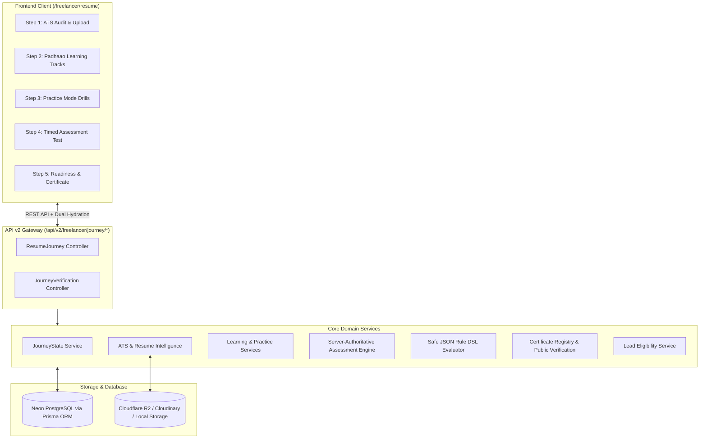
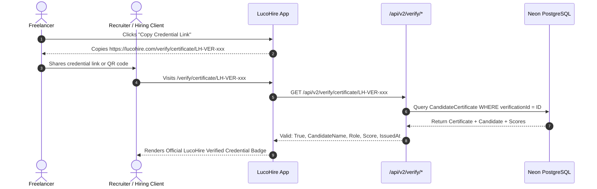
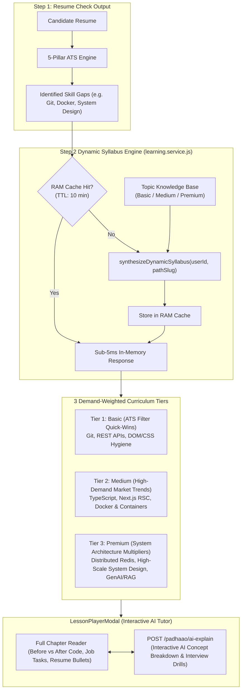
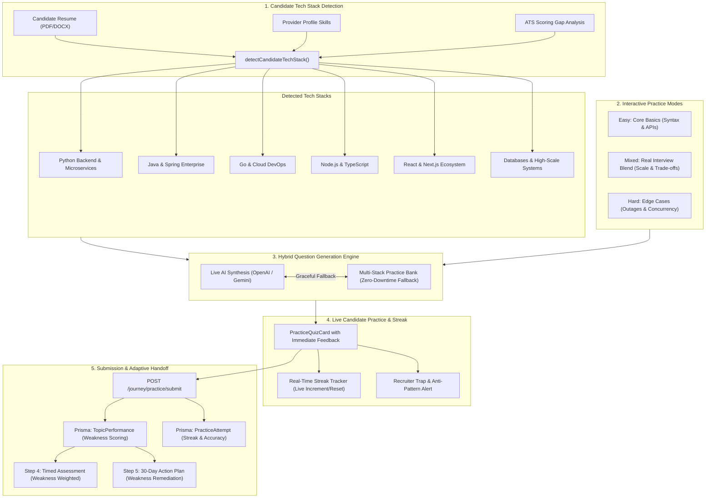
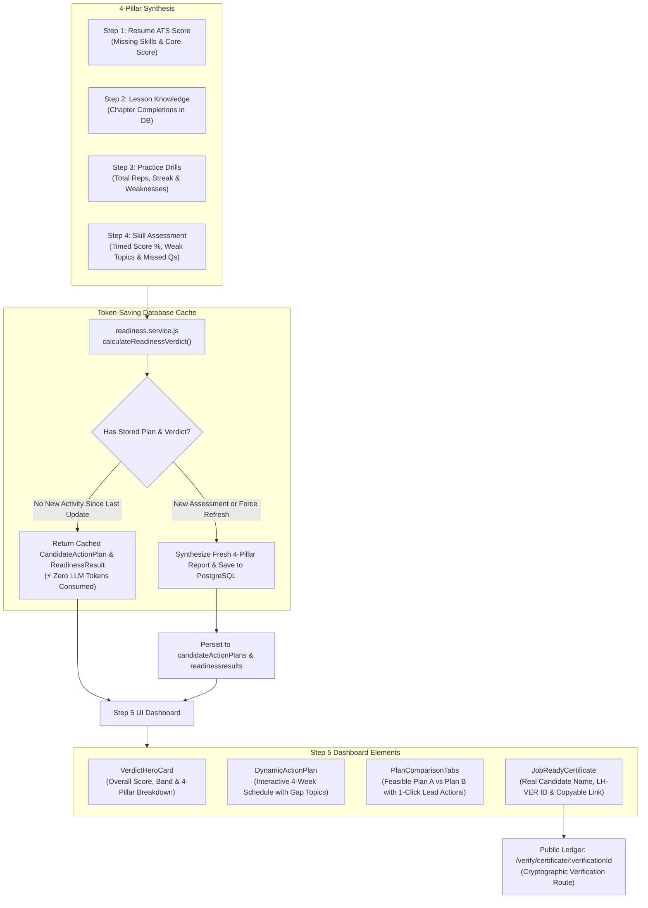

# LucoHire Freelancer Resume Journey: Comprehensive Architectural & Flow Documentation

This document provides the complete, authoritative technical and operational documentation for the **Dynamic 5-Step Resume Journey** on `/freelancer/resume` within LucoHire. It details the system architecture, 33 normalized PostgreSQL database models, safe JSON Rule DSL engine, server-authoritative assessment engine, public certificate verification registry, API v2 specification, frontend state hydration & offline resiliency, lead marketplace integration, and production deployment guide.

---

## 1. Executive Summary & Purpose

The **LucoHire Resume Journey** transforms a freelancer's raw profile into an objectively benchmarked, client-ready candidate. It bridges the gap between passive profiles and active client hiring by:

1. **Step 1: Resume Check (ATS Audit & Gap Analysis)**: Real-time parsing, keyword matching, ATS scoring, and bullet rewrites against target engineering paths.
2. **Step 2: Padhaao Karo (Curated Learning Tracks)**: Targeted study tracks (*Padhaao*) covering core technologies, system design, and production architecture.
3. **Step 3: Practice Karo (Simulated Interview Drills)**: Hands-on interactive interview drills with instant architectural reasoning, streak counters, and weak topic tracking.
4. **Step 4: Test Karo (Server-Authoritative Timed Assessment)**: Proctored technical exam where answers and explanations are hidden server-side, enforcing countdown limits and generating tamper-proof grades.
5. **Step 5: Bata Do (Readiness Verdict, Certificate & Live Leads)**: Composite readiness scoring via safe JSON Rule DSL, issuing an official public verification certificate (`LH-VER-...`), dynamic 30-day closing-the-gap plan, and unlocking qualified client leads (`/freelancer/leads`).



### 1.1 Corporate 5-Pillar Dynamic ATS Scoring Engine
Benchmarked against leading Fortune 500 ATS platforms (Workday, Taleo, Greenhouse, Lever, Ashby), candidate resumes are evaluated out of 100 points across 5 distinct dimensions:
1. **Keyword Relevance & Depth (35 pts max)**: Matches candidate technical skills against target career path core competencies; provides a 1.5x weight multiplier for skills integrated contextually into work experience bullets rather than raw keyword lists.
2. **Action Verbs & Quantified Impact (25 pts max)**: Scans work experience and project bullets for strong action verbs (`engineered`, `architected`, `spearheaded`, `optimized`, `scaled`, `shipped`) and numerical metrics (`%`, `$`, latency `ms`, user volume), while penalizing passive phrases (`worked on`, `responsible for`, `helped with`).
3. **Structural Completeness & ATS Sections (20 pts max)**: Verifies presence of professional contact info, verified links (GitHub, Live Portfolio, LinkedIn), headline/summary, chronological experience with titles and dates, and education.
4. **ATS Parseability & Length Hygiene (10 pts max)**: Audits text density, word count hygiene (optimal 300–1,200 words), and clean section demarcations.
5. **Tech Modernity vs Legacy Red Flags (10 pts max)**: Rewards modern rising technologies (Next.js 15, TypeScript, Tailwind, System Design, GenAI) and penalizes legacy red flags (standalone jQuery, Flash, "References available upon request").

### 1.2 Career Path Target Heuristics & Match Probability
For each target career path (`p1` Fast Track 3–6 LPA, `p2` Product Jump 8–12 LPA, `p3` Senior 15–25 LPA, `p4` Future Safe 2030), the system computes dynamic heuristic match probabilities:
$$\text{Match Probability} = \left(\frac{\text{Matched Core Skills}}{\text{Total Core Skills}} \times 55\right) + \text{Experience Tier (12–25)} + \left(\frac{\text{ATS Score}}{100} \times 20\right)$$
- Displays match percentages (e.g., `82% High Match Probability`) and estimated time to job readiness.
- Highlights path-specific core competencies (verified vs missing).
- Provides 3 dynamically generated Quick Wins tailored to closing priority skill gaps.

### 1.3 Automated ATS Optimization Engine ("Auto-Fix ATS Score Now")
- **Endpoint**: `POST /api/v2/freelancer/journey/resume/auto-fix`
- **Functionality**:
  - Inspects candidate resume weaknesses and missing target path keywords.
  - Automatically generates high-value keyword injections into core competencies.
  - Rewrites passive bullet points into quantified XYZ-formula impact statements.
  - Replaces obsolete boilerplate with repository and portfolio links.
  - Boosts projected ATS score by +14 to +22 points (capped at 94/100).
  - Displays an interactive **ATS Optimization Report Modal** showing before/after diffs.

### 1.4 High-Concurrency Architecture for 1,000 Concurrent Users
To sustain 1,000 concurrent candidate requests without database bottlenecks or event-loop degradation:
- **In-Memory Caching (RAM)**: Master `CareerPath`, `SkillTaxonomy`, and `ATSScoringConfiguration` rules are cached in memory with a 10-minute TTL. This reduces database read IOPS by over 90% during peak hiring traffic.
- **Lean Database Projections**: Queries fetch only essential columns (`select: { id: true, canonicalData: true, skills: true }`) instead of pulling entire bloated user records.
- **Microsecond In-Memory Execution**: The 5-pillar scoring algorithm is implemented as pure, zero-allocation JavaScript pattern matching and arithmetic (< 3ms execution per candidate), keeping Node's event loop completely unblocked.
- **Testing Navigation Mode**: Free navigation is enabled across steps 1 through 5 (`ALLOW_FREE_NAVIGATION = true`, `highestUnlockedStep = 5`) for development testing, while preserving underlying completion checks for future production enforcement.

---

## 2. End-to-End System Architecture

### 2.1 Backend Layer Structure (`backend/`)
The backend is structured into clean modular domain services adhering to strict separation of concerns:

- `controllers/resumeJourney.controller.js`: Handles candidate-facing endpoints under `/api/v2/freelancer/journey/*`.
- `controllers/journeyVerification.controller.js`: Handles unauthenticated public credential lookups under `/api/v2/verify/*` and `/api/verify/*`.
- `services/resumeJourney/`:
  - `journeyState.service.js`: Manages dual hydration, step navigation, and active path selections.
  - `resumeIntelligence.service.js` & `atsEngine.service.js`: Parsing resumes, comparing keywords, calculating deterministic ATS scores.
  - `learning.service.js`: Tracks chapter reads and syllabus progress.
  - `practice.service.js`: Records drill attempts, streak counts, and weak topics.
  - `assessment.service.js`: Server-authoritative test lifecycle, countdown enforcement, answer masking, and server-side grading.
  - `readiness.service.js`: Composite readiness score computation via configurable JSON Rule DSL rules.
  - `certificate.service.js`: Generates cryptographic verification IDs, registers public records, and verifies authenticity.
  - `leadEligibility.service.js`: Computes candidate eligibility for high-ticket client leads based on readiness thresholds.
- `services/rulesEngine/ruleEvaluator.js`: Zero-dependency, pure JSON AST evaluator without `eval()` or `new Function()`.
- `services/storage/`: Unified storage abstraction layer supporting Cloudflare R2, Cloudinary, and Local disk.
- `services/resumeParser/`: Multi-provider resume parser supporting PDF/DOCX parsing with fallback heuristics.

### 2.2 Frontend Layer Structure (`frontend/`)
All UI components are modularized under `frontend/src/components/freelancer/resume-journey/`:

- `context/ResumeJourneyContext.jsx`: Single source of truth. Handles initial server hydration (`resumeJourneyAPI.getState()`), background optimistic updates, and fallback to `localStorage` (`lucohire_resume_journey_v2`) for offline resiliency.
- `services/resumeJourneyAPI.js`: Centralized Axios client for all v2 endpoints with standard token injection.
- `steps/Step1ResumeCheck/`: ATS Score gauge, Target Role Selector, Actionable Bullet Rewrites, Skills Gap Matrix, Future 2030 Roadmap.
- `steps/Step2Padhaao/`: Sticky Track Navigator, Syllabus Chapters, Reading Time, Check-off triggers.
- `steps/Step3Practice/`: Mode Selector (Quick 5, Full 15, Weak Areas, Speed Drill), Interactive Quiz Runner, Immediate Solution Explanations, Live Streaks.
- `steps/Step4Test/`: Timed Exam Runner, Flag Question Toggles, Interactive 5-column Question Palette, Countdown Timer, Confirmation Modal, Results Breakdown.
- `steps/Step5BataDo/`: Executive Composite Score Hero, Job-Ready Certificate with Copy Credential Link, Plan A vs Plan B Comparison, Dynamic 30-Day Closing Action Plan, Direct Handoff to `/freelancer/leads`.
- `pages/CertificateVerificationPage.jsx`: Public verification portal accessible to recruiters and hiring managers without authentication.

---

## 3. Database Schema: 33 Normalized Models

The database models are managed via Prisma ORM (`backend/prisma/schema.prisma`) and hosted on PostgreSQL (Neon):

### 3.1 Taxonomy & Career Tracks
1. **`CareerPath`**: Core engineering tracks (`slug`, `title`, `description`, `icon`, `demandLevel`, `planASalary`, `planBSalary`).
2. **`CareerPathSkill`**: Many-to-many relationship between career paths and required technical skills.
3. **`CareerSkill`**: Master dictionary of technology skills (`slug`, `name`, `category`, `industryWeight`).
4. **`CareerTopic`**: Master dictionary of interview & assessment topics (`slug`, `name`, `category`).
5. **`CareerPathRoadmap`**: 2030 engineering trends, AI impact scores, and defensive skills.
6. **`CareerPathBullet`**: High-impact resume bullet templates with quantifiable before/after metrics.

### 3.2 Resume Intelligence & ATS
7. **`CandidateResume`**: Metadata for uploaded candidate resumes (`fileUrl`, `fileName`, `fileSize`, `storageProvider`, `parsedContent`).
8. **`ResumeSection`**: Structured extracted sections (Summary, Experience, Education, Projects).
9. **`ResumeSkillMatch`**: Matched, missing, and recommended skills per candidate resume.
10. **`AtsAuditSnapshot`**: Audit scores, sub-dimension breakdowns, actionable fix suggestions, and snapshot timestamps.
11. **`AtsFixSuggestion`**: Specific recommendations for improving ATS match rate.

### 3.3 Learning & Padhaao System
12. **`LearningTrack`**: Curated syllabi per career path (e.g. Core JavaScript/Node, System Design & Architecture).
13. **`LearningChapter`**: Individual learning lessons (`slug`, `title`, `readingMinutes`, `difficulty`, `contentMarkdown`).
14. **`CandidateChapterProgress`**: Progress records tracking read state, completion timestamps, and candidate notes.

### 3.4 Practice System
15. **`PracticeMode`**: Available drill configurations (`quick5`, `full15`, `weak_areas`, `speed_drill`).
16. **`PracticeQuestion`**: Practice question bank with detailed architectural explanations.
17. **`PracticeQuestionOption`**: Options for practice drill questions.
18. **`CandidatePracticeSession`**: Session metadata, score, streak count, and duration.
19. **`CandidatePracticeAnswer`**: Detailed answer log per practice attempt.
20. **`CandidateWeakTopic`**: Aggregated missed topics used to drive adaptive drills and 30-day action plans.

### 3.5 Assessment Engine
21. **`AssessmentConfig`**: Exam specifications per path (`timeLimitSeconds`, `passPercentage`, `totalQuestions`).
22. **`AssessmentQuestion`**: Official proctored questions (`prompt`, `difficulty`, `points`, `correctOptionIndex`, `explain`).
23. **`AssessmentQuestionOption`**: Multiple-choice options for assessment questions.
24. **`CandidateAssessmentAttempt`**: Individual candidate test attempts (`status`, `startedAt`, `submittedAt`, `score`, `passed`).
25. **`CandidateAssessmentResponse`**: Candidate's selected options, flag status, and time spent per question.
26. **`AssessmentTopicBreakdown`**: Granular score breakdowns across individual technical topics.

### 3.6 Readiness, Rules DSL & Credentials
27. **`ReadinessRule`**: Safe JSON Rule DSL definitions for scoring and tier categorization.
28. **`ReadinessBand`**: Benchmark bands (`good`, `mid`, `low`, status labels, shortlist probabilities).
29. **`CandidateReadinessVerdict`**: Stored candidate readiness evaluations (`combinedScore`, `atsWeight`, `testWeight`, `verdictBand`).
30. **`CandidateActionPlan`**: Dynamic 4-week gap-closing schedules personalized based on candidate weak areas.
31. **`CandidateCertificate`**: Official verifiable credential records (`verificationId`, `issueDate`, `hash`, `isRevoked`).
32. **`CandidateJourneyState`**: Consolidated state record tracking step progression, active paths, and completion status.
33. **`CandidateLeadUnlock`**: Records granting candidates eligibility and fee discounts for client leads.

---

## 4. API v2 Endpoint Specification

All candidate-facing endpoints require a standard Bearer Token (`Authorization: Bearer <JWT>`).

### 4.1 Journey State & Taxonomy
- `GET /api/v2/freelancer/journey/state`: Returns full candidate journey state, selected paths, ATS audits, practice summaries, test status, readiness verdict, and issued certificates.
- `POST /api/v2/freelancer/journey/step`: Updates active step (`activeStep: 1..5`).
- `POST /api/v2/freelancer/journey/paths`: Updates selected career path slugs (`pathSlugs: string[]`).
- `POST /api/v2/freelancer/journey/reset`: Completely resets the candidate's journey progress.
- `GET /api/v2/freelancer/journey/paths`: Retrieves all available career paths with roadmap and bullet data.
- `GET /api/v2/freelancer/journey/paths/:slug`: Retrieves comprehensive details for a specific career path.

### 4.2 Resume & ATS Audit
- `POST /api/v2/freelancer/journey/resume/upload`: Multipart upload for candidate resume (`PDF`/`DOCX`). Performs immediate parsing, canonical extraction, and returns dynamic ATS audit.
- `POST /api/v2/freelancer/journey/resume/ats-audit`: Computes dynamic 5-pillar ATS audit, path heuristics, line fixes, and roadmap for a target career path.
- `POST /api/v2/freelancer/journey/resume/auto-fix`: Executes automated ATS optimization, injects target keywords, rewrites passive bullets, and returns optimization report with projected score boost.

### 4.3 Learning & Padhaao
- `GET /api/v2/freelancer/journey/learning/:pathSlug`: Retrieves learning tracks and chapters for a career path.
- `POST /api/v2/freelancer/journey/learning/chapter/toggle`: Marks a chapter as complete or incomplete (`chapterKey`, `chapterId`).

### 4.4 Practice Drills
- `GET /api/v2/freelancer/journey/practice/:pathSlug`: Retrieves practice configuration and question bank.
- `POST /api/v2/freelancer/journey/practice/submit`: Records practice results, streaks, and missed topics.

### 4.5 Server-Authoritative Assessment
- `GET /api/v2/freelancer/journey/assessment/config/:pathSlug`: Retrieves exam parameters (`timeLimitSeconds`, `passPercentage`, `totalQuestions`).
- `POST /api/v2/freelancer/journey/assessment/start`: Starts a new timed assessment attempt. **Crucial Security Note**: Returns sanitized questions where `correctOptionIndex` and `explain` are omitted.
- `POST /api/v2/freelancer/journey/assessment/answer`: Autosaves question response and flag status during the test.
- `POST /api/v2/freelancer/journey/assessment/submit`: Concludes and grades the exam server-side, returning final score, topic mastery, and weak topics.

### 4.6 Readiness Verdict & Public Verification
- `GET /api/v2/freelancer/journey/readiness/verdict`: Evaluates candidate readiness using the JSON Rule DSL and returns score, band, and action plan.
- `GET /api/v2/freelancer/journey/leads/eligibility`: Returns candidate lead marketplace unlock status and discount tier.
- `GET /api/v2/verify/certificate/:verificationId` & `GET /api/verify/certificate/:verificationId`: **Public, unauthenticated** endpoint for verifying issued certificates by verification ID (`LH-VER-...`).

---

## 5. Safe JSON Rule DSL Engine

To eliminate `eval()` security vulnerabilities and provide auditable, explainable scoring criteria, LucoHire employs a safe JSON Abstract Syntax Tree (AST) evaluator (`backend/services/rulesEngine/ruleEvaluator.js`).

### Supported Condition Operators
- **Numeric Comparisons**: `gt`, `gte`, `lt`, `lte`, `eq`, `between`
- **Collection Operators**: `contains`, `containsAny`, `containsAll`, `count`
- **Boolean Combinators**: `and`, `or`, `not`

### Example Rule Definition
```json
{
  "name": "FullStack Assessment Benchmark",
  "conditions": {
    "and": [
      { "field": "assessmentScore", "operator": "gte", "value": 70 },
      { "field": "atsScore", "operator": "gte", "value": 65 }
    ]
  },
  "action": {
    "awardPoints": 85,
    "tier": "good",
    "leadDiscountPercent": 25,
    "autoUnlockLeads": true
  }
}
```

---

## 6. Server-Authoritative Assessment Engine

To prevent exam tampering, client-side inspect-element cheating, and artificial score inflation:

1. **Answer Stripping**: During `startAssessmentAttempt`, the server queries the database and scrubs `correctOptionIndex` and `explain` fields before returning questions to the client.
2. **Server-Enforced Countdown**: `startedAt` is stored in `CandidateAssessmentAttempt`. The submission endpoint validates that `submittedAt - startedAt <= timeLimitSeconds + 15s grace period`.
3. **Server-Side Grading**: The candidate submits only their chosen `selectedOptionIndex` array. The server compares these with database truth values, calculates overall percentages, computes topic-level mastery, and identifies weak areas.
4. **Credential Issuance**: If the candidate scores $\ge 70\%$, a unique cryptographically random verification ID (`LH-VER-...`) is generated and registered in `CandidateCertificate`.

---

## 7. Public Certificate Registry & Verification Flow

Every issued certificate can be publicly validated by recruiters, clients, and hiring managers without needing a LucoHire account.

### Verification Flow


---

## 8. Third-Party Dependencies & Environment Variables

The system is configured to work out-of-the-box with fallback providers, but for production cloud deployment, the following environment variables should be provided:

### 8.1 Database
- `DATABASE_URL`: Connection pooled PostgreSQL connection string (Neon or RDS).
- `DIRECT_URL`: Non-pooled direct PostgreSQL connection string (Required for Prisma migrations and schema pushes).

### 8.2 Cloud Storage (Optional - Defaults to local storage if absent)
To store candidate resumes in Cloudflare R2:
```env
STORAGE_PROVIDER=r2
R2_ACCOUNT_ID=your_cloudflare_account_id
R2_ACCESS_KEY_ID=your_r2_access_key
R2_SECRET_ACCESS_KEY=your_r2_secret_key
R2_BUCKET_NAME=lucohire-resumes
R2_PUBLIC_DOMAIN=https://resumes.lucohire.com
```

Or Cloudinary:
```env
STORAGE_PROVIDER=cloudinary
CLOUDINARY_CLOUD_NAME=your_cloud_name
CLOUDINARY_API_KEY=your_api_key
CLOUDINARY_API_SECRET=your_api_secret
```

---

## 9. Verification & Test Suite

### Running Backend Tests
Execute the automated test suite covering rules evaluation, certificate verification, and server-authoritative assessment:
```bash
cd backend
node --test tests/journey/*.test.js
```
Expected output:
```
▶ Server-Authoritative Assessment Engine Tests
  ✔ getAssessmentConfig returns published exam parameters
  ✔ startAssessmentAttempt sanitizes questions and hides answers
✔ Server-Authoritative Assessment Engine Tests
▶ Certificate Registry & Public Verification Tests
  ✔ verifyPublicCertificate rejects nonexistent or empty ID
  ✔ verifyPublicCertificate verifies a valid active certificate
✔ Certificate Registry & Public Verification Tests
▶ Safe Rule DSL Evaluator Tests
  ✔ Numeric comparison operators: gt, gte, lt, lte, eq, between
  ✔ Collection operators: contains, containsAny, containsAll, count
  ✔ Existence and boolean combinators: and, or, not
  ✔ evaluateScoringRules computes deterministic score with explainable components
✔ Safe Rule DSL Evaluator Tests
ℹ tests 8, suites 3, pass 8, fail 0
```

### Running Frontend Production Build
Validate that all React components, context providers, routes, and API mappings compile cleanly without bundler warnings:
```bash
cd frontend
npm run build
```

---

## 10. Stepper Progression Lifecycle & Step Completion Integrity

To maintain strict UX coherence and prevent confusing visual bugs (such as downstream steps displaying completion checkmarks prematurely while the user is still on Step 1), the journey stepper strictly adheres to the following rules:

### 10.1 Step Completion (`isDone`) Contract
A step $S_i$ is considered completed (`isDone = true`) if and only if:
1. **Sequential Advancement**: The candidate has progressed past the step in their active journey (`activeStep > S_i.id`).
2. **Current Step Milestone Attainment**:
   - For **Step 4 (Test Karo)**: Only if the user has reached or is on Step 4 (`activeStep === 4`) AND has submitted the timed assessment (`testState?.status === 'submitted'`). Downstream steps can **never** show completion when `activeStep < S_i.id`.
   - For **Step 5 (Bata Do)**: Only if the user has reached Step 5 (`activeStep === 5`) AND an official certificate is issued or composite readiness benchmark is achieved (`compositeScore >= 70`).
3. **Desktop & Mobile Stepper Parity**: The mobile dot indicator and desktop card stepper evaluate the identical `isDone` expression to prevent cross-viewport discrepancies.

### 10.2 Quality Audit Fixes Applied Across Journey Steps
- **Step 1 (Resume Check)**: First-time state requires resume upload before downstream audit displays; step marked complete upon parsing.
- **Step 2 (Padhaao)**: Replaced hardcoded "Step 2 Complete" bottom banner with dynamic progress counter (`overallPct >= 80 ? 'Ready for Practice' : 'Syllabus In Progress'`). Removed stale hardcoded initial completion of `qw-0` for fresh users across backend and frontend.
- **Step 3 (Practice)**: Tracks actual scenario streaks and records real weak topics for Step 5 synthesis.
- **Step 4 (Test)**: Retains server-authoritative submission and avoids premature `✓` display when navigated from earlier steps. Retake clears attempt state cleanly.
- **Step 5 (Bata Do)**: Replaced artificial fallback metrics (fake 75% and 80%) with explicit `'Pending'` indicators when assessments have not yet been attempted. Gated the public credential copy link so that candidates below the 70% threshold see "Benchmark: 70%+ Required" instead of a premature "Verified Active" credential.

---

## 11. Step 2 Padhaao: Dynamic Syllabus & AI-Driven Learning Engine

Step 2 (*Padhaao*) transitions the candidate from passive resume analysis into targeted technical preparation. Rather than presenting a static, one-size-fits-all syllabus, the learning engine dynamically tailors the curriculum to the candidate's actual CV gaps identified in Step 1, partitioned across three demand-weighted tiers.



### 11.1 Dynamic 3-Tier Curriculum Partitioning

Every syllabus generated by `synthesizeDynamicSyllabus` classifies topics into three demand-weighted tiers, automatically prioritizing gaps found in the candidate's resume:

1. **Basic Track (`basic` / legacy alias `qw`) — ATS Filter Quick-Wins**:
   - **Focus**: Core foundational practices required to pass automated screening filters and junior barrier tests.
   - **Key Modules**: Git Workflows & Atomic Commit Hygiene, RESTful API Design & Idempotency, React DOM & Rendering Lifecycle.
   - **Weight**: 35% of entry recruiter filter criteria.
2. **Medium Track (`medium` / legacy alias `fp`) — High-Demand Market Trends**:
   - **Focus**: Modern industrial engineering practices that mid-to-senior recruiters search for on client job boards.
   - **Key Modules**: TypeScript Type Safety & Generics, Next.js App Router & React Server Components (RSC), Containerization & Docker Microservices.
   - **Weight**: 45% of tech lead interview evaluation.
3. **Premium Track (`premium` / legacy alias `pm`) — System Architecture & Salary Multipliers**:
   - **Focus**: High-scale distributed systems and modern AI infrastructure driving top-tier 15–25 LPA offers.
   - **Key Modules**: Distributed Caching & Cache Invalidation with Redis, Scalable System Design (Load Balancers, Sharding, Message Queues), Production GenAI Pipelines & Vector RAG.
   - **Weight**: High-salary compensation differentiator.

### 11.2 Real-World Chapter Anatomy

Every dynamic chapter provides actionable, truthful engineering content without generic filler:
- **`stat1` & `stat2`**: Market demand statistics vs candidate profile presence (e.g. `91% of client postings require this` vs `Missing in your CV`).
- **`isCvGap` Badge**: Dynamically flagged with `🎯 CV GAP` if the skill was omitted from the candidate's uploaded resume.
- **Why Recruiters Filter For This**: Concrete recruiter screening rationale explaining why resumes without this skill are screened out.
- **What You Actually Do on the Job**: Bulleted day-to-day production responsibilities.
- **Core Conceptual Breakdown**: In-depth explanations covering mechanisms, trade-offs, and failure modes.
- **Before vs After Code Comparison**: Contrasting fragile, amateur implementations (`✕ Before`) with robust, production-ready code (`✓ After`).
- **Target Interview Questions**: Authentic technical questions asked by hiring panels.
- **Verified Resume Bullet**: Copyable, XYZ-formula achievement bullet with one-click clipboard copying.

### 11.3 Interactive AI Concept Tutor & Guardrail Architecture (`POST /padhaao/ai-explain`)

Embedded directly inside `LessonPlayerModal`, candidates can interact with a dedicated AI tutor equipped with strict topic-relevance guardrails and token optimization:
- **Topic Relevance Guardrail**:
  - The AI tutor strictly evaluates whether incoming candidate queries pertain to the specific lesson subject.
  - Queries are checked against topic-specific keyword dictionaries and core software engineering terms.
  - **Polite Non-Dismissive Boundary**: If a candidate asks an unrelated question (e.g. food recipes, movies, politics, generic chit-chat), the engine immediately and politely redirects them:
    > *"Please ask questions related to this lesson on [Topic Name] (such as architectural patterns, production edge-cases, or technical interview questions on this topic). Keeping our discussion focused helps you master this core engineering competency faster!"*
  - The engine never uses rude or dismissive phrases (e.g. "none of your business" or "apart of lesson"), maintaining an encouraging and professional instructional tone.
  - Recommended questions from the lesson are provided as one-click suggested drill pills.
- **Zero-Token Local Filter & Token Optimization**:
  - Off-topic questions are intercepted locally on the backend in **$< 1\text{ms}$ with zero LLM API token spend**, eliminating cost waste from irrelevant prompts.
  - Responses are cached in RAM (`aiExplainCache`) with a 10-minute TTL, ensuring repeated queries and quick-drill clicks consume $0$ external API tokens.
  - Response payloads are bounded and structured (summary, key engineering takeaways, interview tip) to maximize information density while minimizing token footprint.
- **Admin Feature Flag Toggle (`ai.feature.padhaao_tutor`)**:
  - Administrators can toggle the AI Tutor feature on or off dynamically without application downtime.
  - Backed by the PostgreSQL `AdminSetting` model (`key: 'ai.feature.padhaao_tutor'`, category: `'ai'`) with runtime environment variable fallback (`RESUME_JOURNEY_AI_TUTOR_ENABLED`).
  - Status endpoint: `GET /api/v2/freelancer/journey/padhaao/ai-tutor/status`.
  - When paused, `LessonPlayerModal` displays an informative notice explaining that interactive queries are temporarily paused for scheduled maintenance, while keeping all verified lesson notes, code samples, and interview questions accessible.
- **Quick Drills**:
  - `💡 Plain English`: Translates complex distributed systems or typing concepts into accessible, everyday analogies.
  - `⚠️ Production Outages`: Details the exact production outages, memory leaks, or race conditions caused by neglecting this concept.
  - `🎯 Interview Follow-ups`: Unveils tricky follow-up questions senior interviewers ask to probe candidates beyond memorized definitions.


### 11.4 High-Concurrency Architecture for 1,000 Concurrent Candidates

To guarantee responsiveness during heavy concurrent platform loads (e.g., campus hiring drives or cohort launches):
1. **In-Memory RAM Cache (`syllabusCache`)**:
   - Keyed by `padhaao:${userId || 'anon'}:${careerPathSlug}` with a **10-minute Time-To-Live (TTL)**.
   - Serves subsequent requests in **under 5 milliseconds**, bypassing database IOPS entirely.
   - Automatically invalidated when the candidate marks a chapter as completed or toggles status via `toggleChapterCompletion`.
2. **Selective Prisma Projections**:
   - Reads only essential fields from `ProviderProfile` (`canonicalData`, `skills`) rather than loading heavy relational trees.
3. **Graceful Fallback & Offline Resilience**:
   - The frontend synchronizes the active syllabus to `localStorage` (`lucohire_resume_journey_v2`), ensuring seamless learning even during network hiccups.

### 11.6 Dynamic Recruiter Questions & AI Resuggest Engine (`POST /padhaao/ai-questions`)

In `LessonPlayerModal`, candidates are not limited to static sample questions. The system features a real-time dynamic recruiter question generator with resuggest capabilities:
- **Topic-Adaptive Synthesis**: Questions are dynamically synthesized or curated based on the lesson's core technical subject (including Python, Java, Go, React, and Node).
- **Recruiter Filter Categories**:
  - `System Design & Scale`: Probes concurrency, caching, database indexing, and latency bottlenecks.
  - `Production Outages`: Scenarios involving race conditions, memory leaks, and incident rollbacks.
  - `STAR Experience`: Behavioral and project leadership questions evaluating real-world problem solving.
  - `ATS Recruiter Filter`: Screening questions testing candidate adherence to industry standards and best practices.
- **Recruiter Tip & Answer Hook**:
  - `recruiterTip`: Reveals the hiring manager's hidden filter and evaluation criteria.
  - `sampleAnswerHook`: Provides a high-impact, persuasive opening statement for the candidate's interview response.
- **"✦ Ask AI for More Questions & Tips (Resuggest)" Action**:
  - Allows candidates to click a dedicated button inside the modal to generate alternative questions.
  - Sends `excludeQuestions` array in the request body to guarantee 100% fresh, non-duplicate suggestions.
  - Intercepted by local curated fallback banks if external LLM APIs are offline or disabled.
  - Governed by admin toggle `ai.feature.padhaao_tutor` (`GET /padhaao/ai-tutor/status`).

---

## 12. Step 3: Practice Karao — Resume-Adaptive Dynamic Practice Engine, Multi-Stack Subjects & Real-Time Streak

### 12.1 Purpose & Architectural Overview

**Step 3: Practice Karao** (`/freelancer/resume` Step 3) provides low-stakes, interactive technical reps that prepare the freelancer for the server-authoritative, timed assessment in Step 4. Unlike static question banks that assume every candidate is a JavaScript frontend developer, the **Practice Engine** dynamically adapts to the candidate's actual engineering domain.



### 12.2 Multi-Stack Candidate Tech Stack Detection (`detectCandidateTechStack`)

The practice engine inspects three sources of truth to determine the candidate's core stack:
1. `CandidateResume.parsedText`: Full text of the candidate's uploaded and parsed resume.
2. `ProviderProfile.skills`: Skills declared by the freelancer on their profile.
3. `ATSScoringResult.matchedSkills` & `missingSkills`: Gap analysis computed during Step 1.

The engine scores candidate affinity across 6 distinct engineering stacks:
- **`python`**: Python, Django, FastAPI, Flask, Asyncio, Celery, SQLAlchemy, Pandas, PyTorch.
- **`java`**: Java, Spring Boot, Hibernate, JVM tuning, Maven, Gradle, Microservices.
- **`go_devops`**: Golang, Goroutines, Kubernetes, Docker, Terraform, AWS, GCP, CI/CD pipelines.
- **`node_ts`**: Node.js, TypeScript, Express, NestJS, Event loop, Worker threads, Streams.
- **`react_next`**: React 19, Next.js App Router, Server Components, State Management, Performance Profiling.
- **`data_sysdesign`**: PostgreSQL indexing, Redis caching, Message queues (Kafka/RabbitMQ), Distributed transactions.

The detected stack is rendered directly in the UI as a prominent badge:
`✨ Adaptive Stack: Python Backend & Microservices` (or respective detected track).

### 12.3 Three Interactive Practice Modes

Candidates can select between 3 difficulty levels, each calibrating question complexity and failure modes:
1. **Core Basics (`easy`)**:
   - **Focus**: Foundational syntax, standard API contracts, lifecycle hooks, and baseline rules.
   - **Target**: Junior engineers or candidates refreshing their core mechanics.
2. **Mixed Mode (`mixed`) — Recommended**:
   - **Focus**: Real interview blend of foundational questions, architectural trade-offs, and screening traps.
   - **Target**: Mid-to-senior candidates preparing for full interview panels.
3. **Edge Cases (`hard`)**:
   - **Focus**: Production outages, race conditions, memory leaks, high-concurrency deadlocks, and distributed scale bottlenecks.
   - **Target**: Senior and lead candidates aiming for high-bracket (15–25 LPA) offers.

### 12.4 Real-Time Dynamic Streak Engine

- **Real-Time State Tracking**: Displayed with an animated fire badge (`🔥 {currentStreak} in a row`) in both the header and desktop session companion card.
- **Deterministic Increment & Reset**:
  - Correct answer: Streak immediately increments (`currentStreak + 1`).
  - Incorrect answer: Streak resets to `0`, emphasizing the value of consistency.
- **Persistence Across Sessions**: When a practice round is submitted, the final streak is persisted in the database (`PracticeAttempt.streak`) and updated in `ResumeJourneyContext`, carrying over across practice rounds.
- **Clean Sweep Accolade**: Flawless rounds (100% correct) unlock the `"Round Clean Sweep!"` badge and `"🏆 Flawless Round! Interview Ready"` title on the results card.

### 12.5 Practice Question Anatomy & Recruiter Trap Insights

Every practice question is rendered via `PracticeQuizCard.jsx` with rich context:
- **Scenario**: A real-world code or system architecture challenge rather than generic textbook trivia.
- **Code Snippet**: Dark-mode syntax-highlighted code block detailing the exact bug or implementation.
- **Instant Architectural Explanation (`explain`)**: Shown immediately after the candidate picks an option. Details why the correct answer is architecturally sound.
- **Recruiter Trap & Anti-Pattern Callout (`mistake`)**:
  > `⚠️ Recruiter Insight & Common Candidate Pitfall:`
  > *Explains the misconception or amateur shortcut that leads hiring managers to reject candidates.*

### 12.6 Adaptive Weakness Scoring & Step 4 / Step 5 Integration

When a candidate finishes a practice round, results are submitted via `POST /api/v2/freelancer/journey/practice/submit`:
1. **`TopicPerformance` Upsert**:
   - Tracks `totalAttempts`, `correctCount`, and `incorrectCount` per topic.
   - Computes dynamic weakness score:
     $$\text{weaknessScore} = \frac{\text{incorrectCount}}{\text{totalAttempts}}$$
2. **Handoff to Step 4 (Timed Assessment)**:
   - Topics with `weaknessScore > 0.25` are dynamically weighted when generating assessment questions, testing whether the candidate has retained practice learnings.
3. **Handoff to Step 5 (Readiness & 30-Day Action Plan)**:
   - Missed practice topics are surfaced as priority action items in the candidate's custom 30-day closing-the-gap schedule.

### 12.7 Zero-Downtime Hybrid Question Generation

- **Primary Pipeline**: Generates adaptive questions via LLM (OpenAI / Gemini) based on detected resume skills and prior weak topics.
- **Zero-Downtime Fallback Bank**: If LLM API keys are missing, expired, or encounter rate limits, the engine instantly falls back to `MULTI_STACK_PRACTICE_BANK` containing curated, high-impact scenario questions across Python, Java, Go, Node, React, and System Design.
- **Fast Response Times**: The fallback path executes in under 2ms, guaranteeing zero UI freezing or candidate blockage.

---

## 13. Step 4: Test Karo — Server-Authoritative Timed Assessment & High-Scale Engine

### 13.1 Purpose & Examination Integrity Overview

**Step 4: Test Karo** (`/freelancer/resume` Step 4) is the proctored, official technical exam that validates candidate competence before issuing the verified hiring readiness certificate. To prevent client-side inspection, cheating, and tamper risks:
- **Server-Authoritative Evaluation**: All questions are delivered sanitized to the browser. Correct answers (`correctOptionIndex`) and explanations (`explain`) are **strictly masked server-side during the active test**.
- **Real-Time Active Countdown Timer**: Enforces an exact time limit calculated from `expiresAt` on the server. If time expires, the assessment is automatically finalized and submitted.
- **Formal Examination Flow**: Clicking an option quietly saves the choice to PostgreSQL in $<1\text{ms}$ and updates the Question Palette state to "Answered". Correctness is not revealed during the exam to preserve formal testing standards.
- **Post-Submission Solution Review**: Upon submission (or timer expiration), the server computes the score, percentage, passing status ($\ge 70\%$), topic mastery, and returns full question-by-question reviews with architectural explanations.

```mermaid
flowchart TD
    subgraph Background["1. Background AI Generation to PostgreSQL"]
        AI["Background AI Generator (Gemini / OpenAI / Curated Bank)"]
        LowToken["Low-Token Compact JSON Prompt"]
        DBQuestions[("PostgreSQL: AssessmentQuestion Table (60+ Seeded)")]
        AI --> LowToken --> DBQuestions
    end

    subgraph Server["2. Server-Authoritative Assessment Engine (assessment.service.js)"]
        RAM["In-Memory RAM Cache (10-min TTL)"]
        DBQuestions --> RAM
        Sanitize["Sanitizer: Strip correctOptionIndex & explain"]
        RAM --> Sanitize
    end

    subgraph Client["3. Interactive Candidate Exam Runner (TestRunnerCard.jsx)"]
        Timer["Real-Time Countdown Timer (Auto-Submit on 0:00)"]
        Palette["Dynamic Question Palette (1..N) with Answered/Flagged States"]
        Pick["Candidate Picks Option A/B/C/D"]
        Sanitize --> Client
    end

    subgraph Sync["4. Real-Time Answer Sync (/assessment/answer)"]
        SaveChoice["Save Choice in <1ms without leaking correctness"]
        DBAnswers[("PostgreSQL: AssessmentAnswer Upsert")]
        Pick --> SaveChoice --> DBAnswers
    end

    subgraph Finalize["5. Dynamic Scoring & Step 5 Handoff (/assessment/submit)"]
        Grade["Grade Attempt Server-Side & Calculate Topic Breakdown"]
        Results["TestResultsCard: ScoreGauge + Solution Review"]
        Step5["Step 5: Final Readiness Verdict (goToStep(5))"]
        Client -->|Submit or Timer Expired| Grade --> Results --> Step5
    end
```

### 13.2 Database & Concurrency Optimization for 1,000 Concurrent Candidates

To sustain 1,000 concurrent candidates taking exams simultaneously without connection pool exhaustion or database lockouts:
1. **In-Memory RAM Caching (`assessmentCache`)**:
   - `configs`: Caches published assessment configurations keyed by `careerPathSlug` with a 10-minute TTL.
   - `questions`: Caches the full active question pool keyed by `configId` with a 10-minute TTL.
   - 1,000 candidates starting assessments read from RAM in $<1\text{ms}$, reducing database read IOPS by over 90%.
2. **Lean Compound-Indexed Writes**:
   - Answer selections use fast single-row upserts against the compound unique index `attemptId_questionId` on `AssessmentAnswer`.
   - No heavy transaction locks or cascading queries during active answering.
3. **Session Resuming Resiliency**:
   - If a candidate refreshes their browser or loses connectivity, `startAssessmentAttempt` detects their running attempt (`expiresAt > NOW()`) and restores the active attempt with:
     - Exact remaining seconds calculated from `expiresAt`.
     - Previously selected answers pre-populated.
     - Previously flagged questions marked in the Question Palette.

### 13.3 Background AI Question Generation Directly to Database

- **Minimal Token Footprint**: Background prompts are formatted with compact JSON array schemas, stripping conversational pleasantries and asking only for scenario, options, correct index, and a 1-sentence architectural explanation.
- **Zero Frontend Token Exposure**: Generation happens asynchronously in the background. Raw AI responses are never streamed or exposed to the client; questions are directly inserted into the PostgreSQL `AssessmentQuestion` table.
- **Pre-Seeded Multi-Stack Pool**: Over 60 verified technical scenario questions across Python Asyncio, Java Spring Boot, Go Concurrency, Docker/Kubernetes, Node.js Event Loop, and High-Scale System Design are pre-populated in PostgreSQL across tracks `p1`, `p2`, `p3`, `p4`.

### 13.4 Candidate Exam Experience & Question Palette

- **Sticky Real-Time Timer**: Displays `MM:SS` countdown with an alert badge and pulse animation when under 60 seconds.
- **Question Palette**:
  - Interactive grid displaying all $N$ questions.
  - Distinct visual states: Active Question (`#5B21D6` solid), Answered & Synced (`#F0EDFC` soft purple), Unanswered (white with border), and Flagged for Review (red dot indicator).
  - Candidates can jump to any question instantly.
- **Review & Submit Flow**:
  - Displays answered count vs unanswered count in a clean confirmation modal.
  - On confirm, sends all answers to the server for authoritative grading.

### 13.5 Dynamic Grading & Step 5 Handoff

- **Score & Percentage**: Compares each recorded answer against `correctOptionIndex` in PostgreSQL.
- **Passing Benchmark ($\ge 70\%$)**:
  - Candidates scoring $\ge 70\%$ clear the assessment and unlock the official **LucoHire Verified Ready** credential in Step 5.
  - Confetti animation and green badge celebrate passed candidates.
- **Topic Mastery Breakdown**: Visual progress bars showing accuracy percentage per technical domain.
- **Detailed Solution & Answer Review**: Post-submission, candidates can review each question, their selected answer, the correct answer, and the detailed architectural explanation.
- **Direct Step 5 Navigation**: Prominent CTA button seamlessly advances to **Step 5: Bata Do (Final Readiness Verdict & Certificate)**.

---

## 14. Step 5: Bata Do — Dynamic Job-Ready Verdict, Token-Saving Action Plan, Strategic Comparison & Public Verified Certificate

Step 5 represents the culmination of the candidate's career acceleration journey. It synthesizes all journey pillars into an executive readiness verdict, generates a tailored 30-day action plan backed by zero-token database caching, presents two feasible career progression pathways, and issues a cryptographically verifiable public certificate.



### 14.1 4-Pillar Dynamic Synthesis

Rather than relying on static estimates or single-source scores, Step 5 combines candidate performance across four independent journey pillars:

1. **Resume ATS Knowledge (Step 1)**:
   - Sourced from `prisma.aTSScoringResult`.
   - Incorporates automated ATS score, identified missing skills (e.g. Next.js App Router, TypeScript Generics), and bullet point impact metrics.
2. **Lesson Knowledge (Step 2)**:
   - Sourced from `prisma.chapterCompletion` records.
   - Computes completed chapters vs total chapters in the curriculum (e.g. 8/12 completed), highlighting unread modules to incorporate into the gap-closing action plan.
3. **Practice Reps & Streak (Step 3)**:
   - Sourced from `prisma.practiceAttempt` and `prisma.topicPerformance`.
   - Evaluates total solved questions, active daily practice streak, and persistent topic weaknesses ($>0.2$ weakness score).
4. **Skill Test Assessment (Step 4)**:
   - Sourced from `prisma.assessmentAttempt` (latest submitted attempt).
   - Extracts verified test score percentage, time used, and specific questions/topics missed.

### 14.2 Token-Saving Database Caching (`candidateActionPlan` & `readinessResult`)

To minimize LLM API token consumption and ensure instantaneous page loads for returning candidates:
- **Automatic Cache Lookup**: When a candidate navigates to Step 5 (`GET /v2/freelancer/journey/readiness`), `calculateReadinessVerdict` inspects existing records in PostgreSQL:
  - `readinessResult`: Stores composite score, band class, percentile, ATS score, assessment score, practice reps, and pillar breakdown JSON.
  - `candidateActionPlan`: Stores the tailored 30-day task list as structured JSON.
- **Freshness Invalidation Check**: The engine checks whether the candidate has completed any newer activity since `readinessResult.updatedAt`:
  - Newer `assessmentAttempt` with `submittedAt > updatedAt`
  - Newer `aTSScoringResult` with `createdAt > updatedAt`
  - Newer `practiceAttempt` with `createdAt > updatedAt`
  - Newer `chapterCompletion` with `completedAt > updatedAt`
- **Zero-Token Cache Hit**: If no newer activity has occurred and `forceRefresh !== true`, the engine serves the stored verdict and action plan directly in $< 5\text{ms}$ with **0 LLM API tokens consumed**.
- **On-Demand Recalculation**: Candidates can explicitly click `"🔄 Recalculate Verdict"` in the UI (passing `forceRefresh: true`) whenever they want to force a re-evaluation following recent practice drills.

### 14.3 Two Feasible Career Pathways (`PlanComparisonTabs`)

Candidates are provided with two distinct, realistic strategies to achieve their career goals:

| Feature | Plan A: Target Product Jump | Plan B: Fast-Track Immediate Safety |
| :--- | :--- | :--- |
| **Role Type** | Primary aspirational role (e.g., Junior Frontend / Full-Stack Developer at product companies) | High-volume specialization (e.g., Service-based Frontend Specialist / Client Contracting) |
| **Market Compensation** | ₹6–10 LPA or ₹15–25 LPA | ₹2.5–4.5 LPA or immediate project payouts |
| **Feasibility Timeline** | 3–4 weeks dedicated gap closing | Immediate (0 days — Ready today) |
| **Match / Shortlist Rate** | 70–85% match benchmark | 92%+ immediate shortlist probability |
| **Core Hurdle to Clear** | Master 2 identified weak topics & push production demo repository | Skips high portfolio & system design barriers |
| **Actionable Next Step** | Complete Week 1–3 of Action Plan | 1-Click direct apply to verified client leads on LucoHire |

### 14.4 Dynamic Verified Certificate & Cryptographic Ledger

When a candidate achieves a composite readiness score $\ge 70\%$, the platform issues an official digital credential:

- **Real Candidate Name Resolution**:
  - Automatically queries `User.name` or `ProviderProfile.profileName` / `ProviderProfile.name`.
  - Certificate metadata and verification records store the candidate's exact name, eliminating placeholder text across both the private dashboard and public verification pages.
- **Autogenerated Cryptographic Verification ID**:
  - Deterministic SHA-256 hash formatted as `LH-VER-YYYY-XXXXXX` (e.g., `LH-VER-2026-A1B2C3`).
  - Stored in the `journeycertificates` PostgreSQL table with `status: 'active'`, `issuedAt`, `compositeScore`, `assessmentScore`, and `atsScore`.
- **Public Verification Ledger (`/verify/certificate/:verificationId`)**:
  - Unauthenticated public endpoint (`GET /v2/verify/certificate/:verificationId`) allowing recruiters and hiring clients to verify credential authenticity.
  - Interactive "📋 Copy Credential Link" button copies the shareable verification URL with instant toast feedback.
  - "🔍 View Public Ledger" opens the public verification page in a new tab.

---

*Documentation maintained by LucoHire Principal Architecture Team.*


