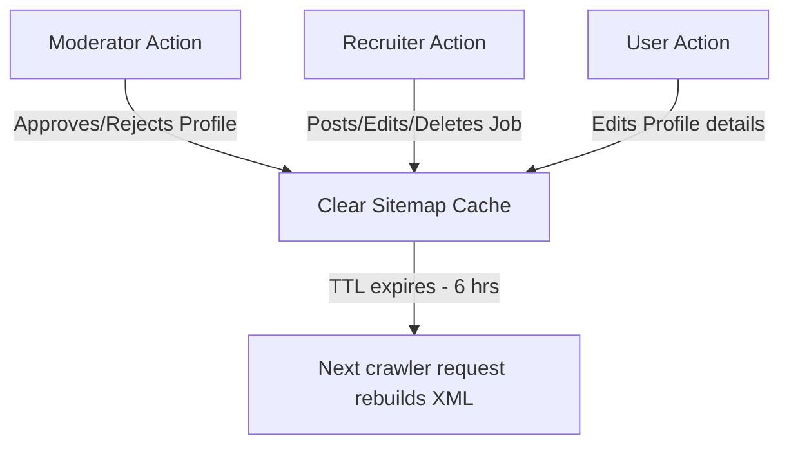

# Lucohire — SEO Crawl & Dynamic Sitemap Setup Context

This documentation details the professional SEO crawl configuration, robots.txt control, dynamic sitemap XML generation, caching policies, and metadata rules implemented in the ServiceHub / Lucohire application.

---

## 1. What Was Implemented

1. **Centralized Robots Control (`robots.txt`)**: Overwrote `frontend/public/robots.txt` to permit search engines to index public sections while blocking private dashboard directories, checkout forms, payment systems, and administrative interfaces.
2. **Dynamic Sitemap Endpoint (`GET /sitemap.xml` & `/api/sitemap.xml`)**: Implemented a real-time sitemap generator that serves structured XML content under the `application/xml` content-type.
3. **In-Memory Caching System (`sitemapCache.js`)**: Integrated high-performance memory caching (6 hours TTL) to optimize server queries, avoiding hitting the database on consecutive crawler requests.
4. **Decoupled Cache Clearing (DB Hooks)**: Set up automatic cache-invalidation hooks on crucial database triggers:
   - When a job posting is created (`postJob`), updated (`updateJob`), or deleted (`deleteJob`) by recruiters.
   - When a provider profile is updated by the provider (`updateProfile`).
   - When recruiter profile details are updated by the owner (`updateProfile`).
   - When any provider/recruiter profile is approved or rejected by managers or administrators (`applyApprovalDecision`).
5. **Vite Local Server Proxy Config**: Added proxy rules for `/sitemap.xml` and `/robots.txt` in `vite.config.js` to simplify local development testing.
6. **Centralized Metadata Protection**: Used the `Seo` helmet wrapper component inside dashboard routes groups (`ProviderRoutes`, `RecruiterRoutes`, `AdminRoutes`, `PartnerRoutes`, `ProfilePage`, `PendingApproval`) to render strict `<meta name="robots" content="noindex,nofollow" />` tags, guaranteeing search engines will never index private views.

---

## 2. Robots.txt Configuration

File Location: `/frontend/public/robots.txt`

```text
User-agent: *
Allow: /

Disallow: /admin
Disallow: /dashboard
Disallow: /provider-dashboard
Disallow: /recruiter-dashboard
Disallow: /partner-dashboard
Disallow: /login
Disallow: /signup
Disallow: /forgot-password
Disallow: /reset-password
Disallow: /settings
Disallow: /checkout
Disallow: /payment
Disallow: /transactions
Disallow: /verification
Disallow: /api
Disallow: /private
Disallow: /internal
Disallow: /tmp

Sitemap: https://lucohire.mallofcayman.online/sitemap.xml
```

---

## 3. Dynamic Sitemap XML Logic

- **Standard Static Routes Included**:
  - Homepage (`/`) — priority `1.0`, changefreq `daily`
  - Search/Listings (`/search`) — priority `0.9`, changefreq `hourly`
  - FAQ (`/faq`) — priority `0.6`, changefreq `monthly`
  - Terms (`/terms`) — priority `0.4`, changefreq `yearly`
  - Privacy (`/privacy`) — priority `0.4`, changefreq `yearly`
  - Contact Us (`/contact`) — priority `0.5`, changefreq `monthly`
- **Dynamic Database Records Processed**:
  - **Active Jobs**: Query `JobPost` records where `status === 'active'`. (Slugified dynamic route: `https://lucohire.mallofcayman.online/jobs/job-slug-id`).
  - **Approved Provider Profiles**: Query `ProviderProfile` records where `isApproved === true` or `approvalAction === 'approved'`. Populate the `user` reference and discard unapproved, blocked, or inactive user profiles. (Dynamic route: `https://lucohire.mallofcayman.online/provider/id`).
  - **Approved Recruiter Profiles**: Query `RecruiterProfile` records where `isApproved === true` or `approvalAction === 'approved'`. Populate and verify corresponding `user` status. (Dynamic route: `https://lucohire.mallofcayman.online/recruiter/id`).
  - **Active Skill Categories**: Query `SkillCategory` records where `isActive === true`. (Category list route: `https://lucohire.mallofcayman.online/search?category=slug`).
- **Escaping & Compliance**: Special characters like `&`, `<`, `>`, `"`, and `'` are strictly escaped to produce 100% compliant XML.
- **Safety Limits (Sitemap Index)**: In compliance with Google requirements, if total records exceed 50,000, the controller automatically formats a Sitemap Index layout splitting static and dynamic URL pages.

---

## 4. Cache Policy & Hooks

### Invalidation Triggers


Cache files modified:
- `backend/controllers/adminController.js`: Clears cache on moderation decisions.
- `backend/controllers/providerController.js`: Clears cache when a provider updates their details.
- `backend/controllers/recruiterController.js`: Clears cache when a recruiter updates profile details or submits/modifies jobs.

---

## 5. Verification Checklist

1. **Robots Verification**:
   - Navigate to `/robots.txt`.
   - Ensure the output strictly blocks `/admin`, `/dashboard`, `/checkout`, `/payment`, `/api`, and properly links to `/sitemap.xml`.
2. **Dynamic Sitemap XML Parsing**:
   - Navigate to `/sitemap.xml`.
   - Ensure it returns standard XML headers and validates using online XML Schema checkers.
   - Verify it lists dynamic active jobs and approved profiles while completely omitting draft/closed jobs and pending/rejected profiles.
3. **Crawl Protections Audit**:
   - Inspect public landing pages, verify that title, description, and canonical path tags are loaded.
   - Inspect any private panel (e.g. `/provider/dashboard`), verify that `<meta name="robots" content="noindex,nofollow" />` is rendered inside `<head>`.
4. **Cache Invalidation test**:
   - Access `/sitemap.xml` (verify load is cached).
   - Create a test job or update a profile on local database.
   - Re-access `/sitemap.xml` and verify that the sitemap cache refreshed immediately.

---

## 6. Rollback Notes

If you need to roll back the dynamic sitemap system to a static sitemap layout:
1. Re-create a static `sitemap.xml` inside `frontend/public/sitemap.xml`.
2. Revert the proxy config changes in `frontend/vite.config.js`.
3. In `backend/server.js`, remove `/sitemap.xml` and `/api/sitemap.xml` express routers.
4. Remove sitemap cache hooks from `adminController.js`, `providerController.js`, and `recruiterController.js`.
